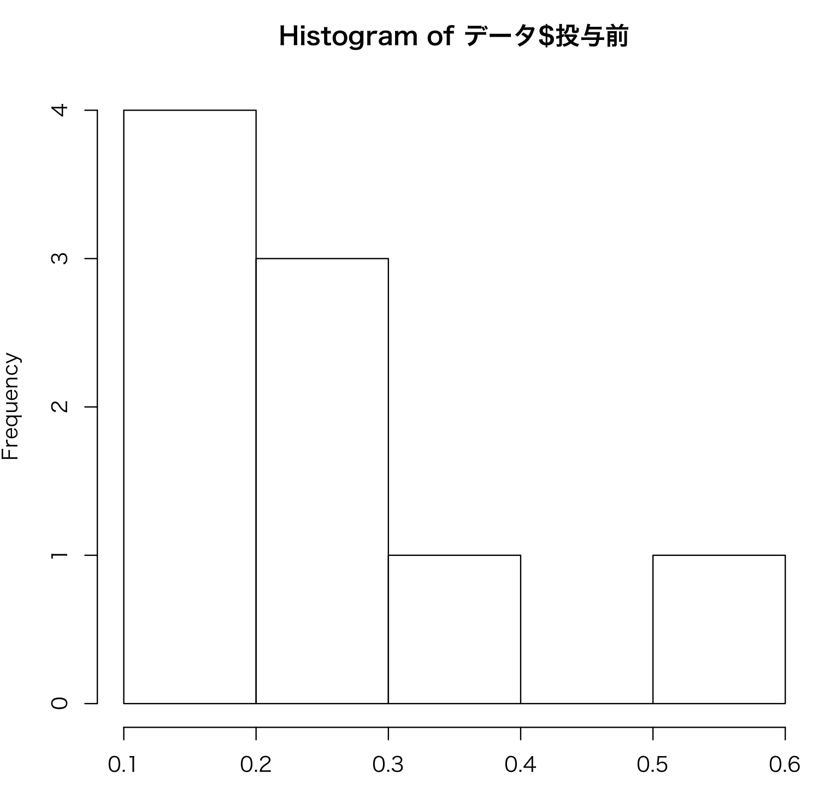
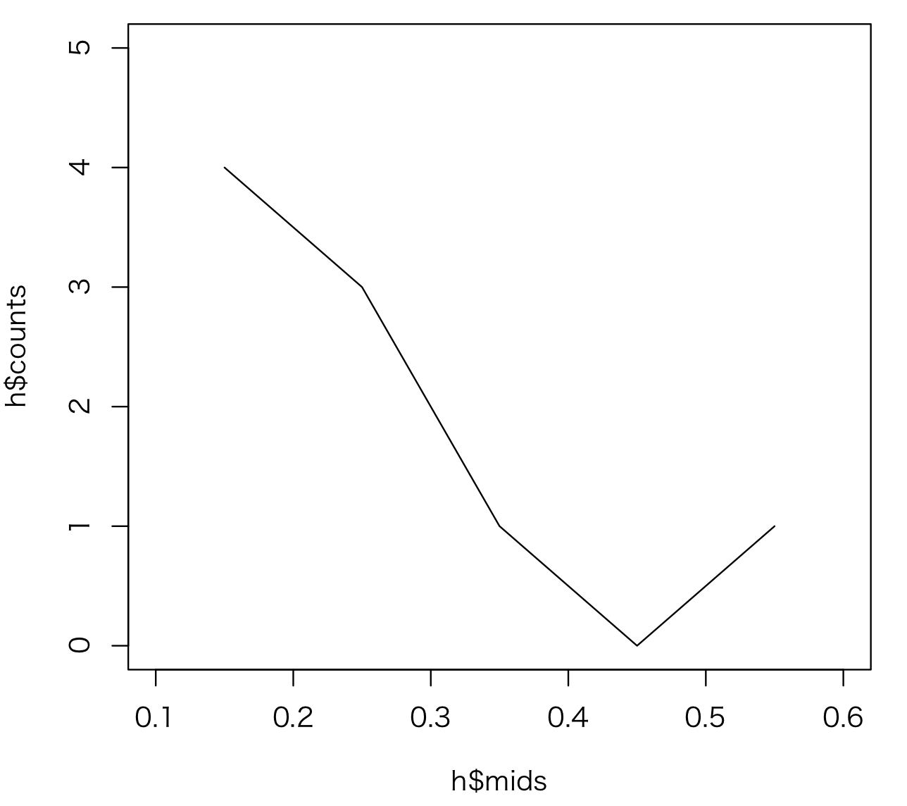
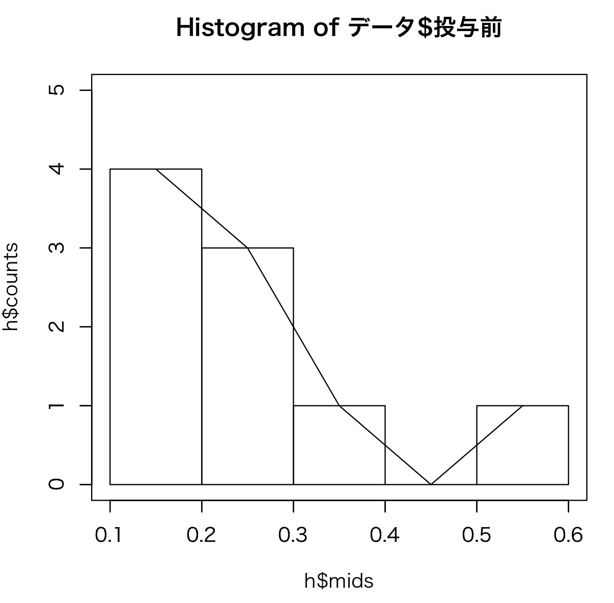
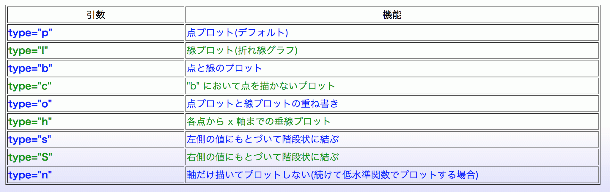
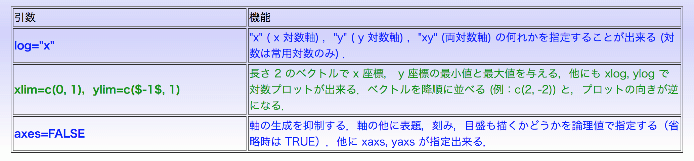
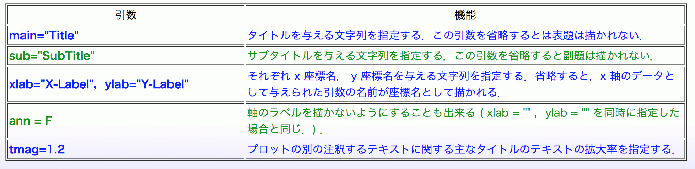

# 医学統計学演習：資料2

芳賀昭弘  
Electronic address: haga@tokushima-u.ac.jp

## 復習：Rを使った計算とデータの読み書き

Rを起動し、デスクトップのMSEフォルダ（前回作成した本演習用のディレクトリ）に「ディレクトリの変更（移動）」後、次のようにデータを読み込んでみよう。

```r
> data <- read.csv("EOM2.csv")
> data
```

EOM2.csvファイルがデータという名前のデータフレームで読み込まれて、その内容が記述される。

（ヒント）：ダブルクォーテーションはpdfからコピーするとR上うまく反映しませんのでご注意を。

## スクリプト

emacsやRのテキストエディタを使って以下が書かれている内容を記載し、test_script.Rという名前で保存しよう。

```r
# test_script.Rの内容
data <- read.csv("EOM2.csv")
print(data)
# ここまで
```

print(data)を使う。cat(data)はデータフレームの表示には適さない。次にRのコンソール画面で次のように書くと...

```r
> source("test_script.R")
```

1の復習でやったのと同じ結果が出力されましたね。つまり、これまで２行で与えていた結果が、`> source("test_script.R")` と１行打つだけで得られるようになった。

`source("***.R")` は `***.R` に書かれた内容を順に実行していくということ。このような方法を**スクリプト**と呼び、ファイルをスクリプトファイルと呼ぶ。これを応用し、次のような内容にtest_script.Rを書き換えて実行してみよう。

```r
# test_script.Rの内容
data <- read.csv("EOM2.csv")
subtra.0 <- data$Just.after - data$Before
subtra.1 <- data$One.hr.after - data$Before
EOM3 <- data.frame(data,subtra.0,subtra.1)
print(EOM3)
# ここまで
```

処理の内容が理解できているでしょうか？

１行目でデータを読み込み、投与後と投与前の差分（２行目）、投与後１時間と投与前の差分（３行目）を計算し、それを元のデータにくっつけています（４行目）。

どうでしょう？これがどれほど便利なものか、まだわからないと思います。しかし、同じような処理を繰り返す必要がある場合、スクリプト処理は非常に便利になります。実際、スクリプトを使えばどのような処理でも、Rのコンソール画面では１行（source(***.R)）書けば済むことになります。

本講義では簡単な統計解析しか行わないため、スクリプト処理を行う必要がないものばかりですが、スクリプトという考え方に慣れる目的で、処理をなるべくスクリプトファイルに書いて実行することにします。

## 関数を作る

関数は、入力値($x$)に応じた出力値($f(x)$)を与えるものと考えることができる。スクリプトでも同じことができるが、function()という関数がRで提供されているのでそちらを使うほうが便利な場合がある。それでは、次のような内容が書かれたvarp.Rファイルを作成してください。

```r
# varp.Rの内容
varp <- function(x){
    sampvar <- var(x)*(length(x)-1)/length(x)
    sampvar
}
# ここまで
```

これは標本分散を計算する関数です（varはRで与えられている不偏分散を計算する関数だが、ここで作ったvarpは標本分散を計算する）。

保存したら、

```r
> source("varp.R")
```

と打っておく。これで、varp関数をRで使うことができるようになる。試しに、EOM2.csvの投与前（Before）の標本分散を求めてみよう。

```r
> varp(data$Before)
```

標本分散が正しく出力されているでしょうか？

注：`var(data$Before)` と比べてみよう。どちらが大きい？その理由は？

今回の例では値を引き渡す変数（引数という）xはベクトルでした。スカラーを引数にしたり高次元行列を引数にしたりすることも勿論可能。複数の変数を引数にすることも可能（→練習問題）。

**練習問題：** $x$と$y$を入力すると、次式の値を出力する関数を作成せよ。

$$
x^2+y^2 -2xy
$$

また、$x = 5$、$y = -2$の結果を出力せよ。

ヒント：プログラム上の関数名を$fxy$とすると、$x, y$の二変数なので、関数は `fxy <- function(x,y)` とする。

## グラフの作成

データを得たら、先ずグラフ化して眺めてみることが肝要です。グラフに描くことで、データの傾向が何となく掴めるということだけでなく、データに異常がないか、データ収集やデータの前処理に間違いがないかを確認するという意味でも、決して欠かしてはいけない非常に大事なステップであると言えます。Rには様々なグラフ描画機能がついています。Rのグラフ機能をマスターすれば、Rを使っていつでもどこでもお好みのグラフを作ることが可能となります。ここでは、ヒストグラムと２次元プロットの描画方法について説明します。

### ヒストグラム（度数分布表）

EOM2.csvの投与前（Before）のデータは次のように見ることができる。

```r
> data$Before
```

解答欄：＿＿＿＿＿＿＿＿＿＿＿＿＿＿＿＿＿＿

この変数を0.1間隔あたりの頻度で表したものが次の表で、これを度数分布表と呼ぶ。

| 投与前 | 人数 |
|---|---:|
| 0.1 ～ 0.2 | 4 |
| 0.2 ～ 0.3 | 3 |
| 0.3 ～ 0.4 | 1 |
| 0.4 ～ 0.5 | 0 |
| 0.5 ～ 0.6 | 1 |

これを棒グラフで表したのが、ヒストグラムである。Rでは度数分布表をわざわざ作成しなくても、次のようにすればデータからヒストグラムを作ることができます。

```r
> hist(data$Before)
```



ヒストグラムはデータの傾向を直感的に理解しやすくする一方、変数間隔の幅（ビン幅, Bin size）によって印象も変わってくる。

ビンの数（ヒストグラムの棒の数）をκとおくと、ビン幅としておおよそ `(max(x)-min(x))/κ` を使う。データ数をnとした場合、Rではデフォルトで二項分布で適切な幅として得られているスタージェスの公式 `κ = 1 + log2(n)` で幅を決定しているので注意が必要である。他にも `κ = sqrt(n)` を使ったり、データに合わせて適切な値を設定してももちろん良い。

ビン幅を変えるには、次のようにbreaksを使う；

```r
> hist(data$Before, breaks=seq(0,1,0.05))
```

この例では、$0\sim1$の範囲を0.05のビン幅でヒストグラムを生成している。

### ２次元プロット

２次元プロットでは、２つの変数を点や線で描画する。上のヒストグラムを２次元プロットで表示してみよう。

```r
> h <- hist(data$Before)
> plot(h$mids, h$counts, xlim=c(0.1,0.6), ylim=c(0,5), type = "l")
```

１行目でヒストグラムデータをhという変数に格納し、２行目でビンの中間値（0.1～0.2の場合は0.15）を横軸（h$midsのこと）、対応する人数を縦軸（h$countsのこと）として横軸の範囲（xlim=c(0.1,0.6)）と縦軸の範囲（ylim=c(0,5)）を指定して、線でプロット（type = "l"）した結果が次の図になります。

これをヒストグラムに重ねて表示してみましょう。



```r
> h <- hist(data$Before, xlim=c(0.1,0.6), ylim=c(0,5), xlab="", ylab="")
> par(new=T)
> plot(h$mids, h$counts, xlim=c(0.1,0.6), ylim=c(0,5), type = "l")
```

２行目のpar(new=T)を挿入することで、グラフを重ねて表示することができます。１行目で挿入したxlab="", ylab=""は、横軸と縦軸のラベルを空白にしたことを意味します。



１回の講義で網羅的に説明することは不可能なほど、Rによるグラフ作成にはたくさんの機能があります。参考書を読んだり、使いたい機能をウェブで検索するなどして各自で学ぶようにしてください。

**練習問題：** グラフの線の太さを太くし且つ色を赤に変更せよ。

## 演習

1. 正の整数である$a$と$b$（$a<b$）を入力すると、$a$から$b$までの整数の和を与える関数を作成せよ。また、$a = 5$、$b = 10$の結果を出力せよ。

   ヒント：プログラム上の関数名を$linspace$とすると、$a, b$の二変数なので、関数は `linspace <- function(a,b)` とする。繰り返し演算はfor文を使うこと。`for (i in a:b)` とすると、$i$に$a$から$b$までの整数が入る。

   ```r
   func1 <- 0
   for ( i in a:b) {
       func1 = func1 + i
   }
   ```

2. 前節でおこなった２次元プロットとヒストグラムの重ね合わせのスクリプトファイルを作成せよ。

   （ヒント：EOM2.csvを読み込んで、図3が出力されるスクリプトを作る）

3. 上記のスクリプトで、"Before"を"Just.after"に変えて実行してみよう。結果は期待通りだったでしょうか？期待通りではなかった場合、何が悪かったのでしょうか？

manabaの小テストにスクリプトをコピー＆ペーストで貼り付けて**解説する**こと。







参考HP: http://cse.naro.affrc.go.jp/takezawa/r-tips/r/48.html
