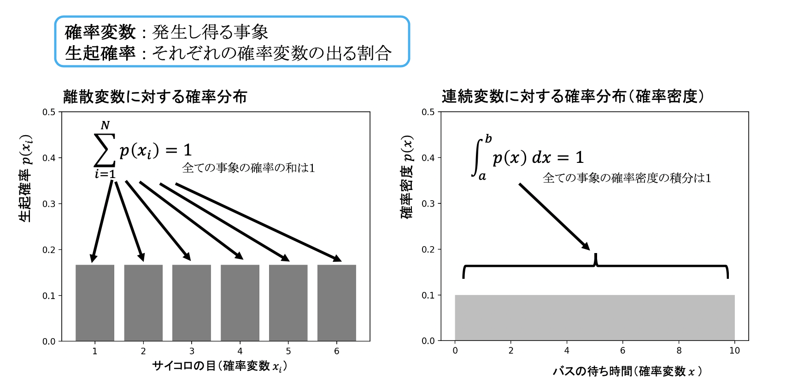
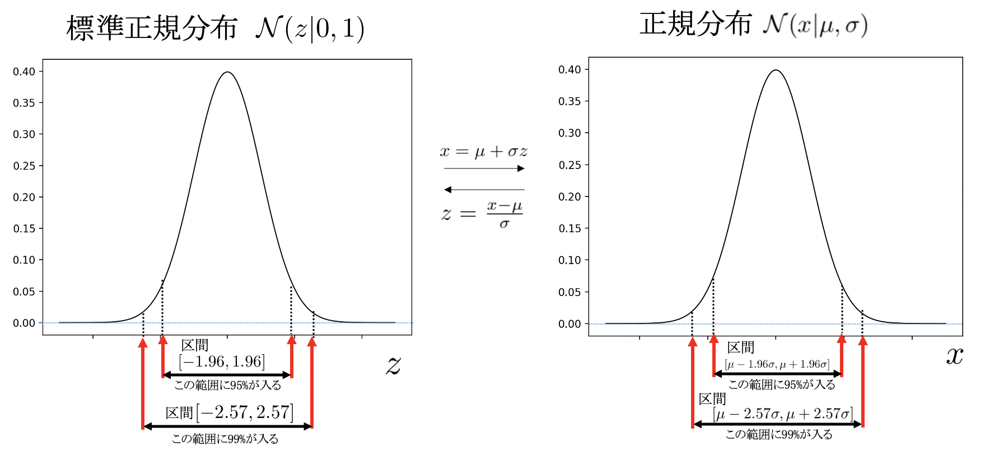
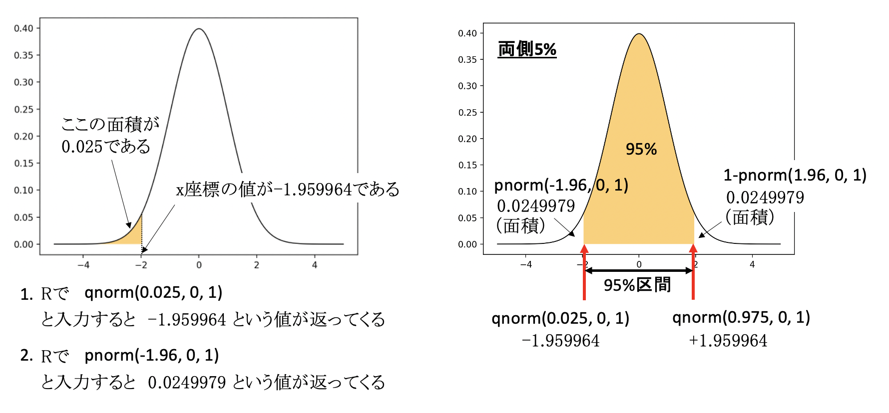

# 医学統計学演習：資料4

芳賀昭弘  
Electronic address: haga@tokushima-u.ac.jp

## 復習：グラフ（ヒストグラム）の作成

Rを起動し、次のように入力してみよう。

```r
> saikorome <- c(1:6)
> saikorodata <- rep(1/6, 6)
> saikoro <- data.frame(saikorome,saikorodata)
> hist(saikorome,breaks=seq(0.5,6.5,1),probability=T,ylim=c(0,1))
```

ヒストグラムがプロットされましたね？  
1から6までの整数の値が確率1/6で起こる確率分布をヒストグラムで書くとすると図のようになります。本日のテーマは「確率分布」です。

## 確率分布

確率分布は次の条件を満たす必要があります。

- 生起確率は負にならない。
- 取り得る確率変数の生起確率を全て足す（連続変数では積分する）と1になる。

確率変数のある値に対する生起確率は、その頻度（何回起こったか）を試行数で割ったものなので、負にはなり得ません。また、確率変数の取り得るすべてを考えれば、そのどこかには必ず生起しているはずですので、後者が成り立つことも容易に理解できると思います。

考える対象によって、確率分布は色々な形をとることになりますが、統計学においては特に次の一様分布、二項分布と正規分布が良く現れてきます。

### 一様分布

一様分布を例に、基本的な用語を確認しておきたいと思います。コインを投げて表裏を当てるゲームを考えてください。細工されていない理想的なコインでは、表と裏の出る回数は同じであると想像できます。

サイコロを投げて出る目の数を当てるゲームではどうでしょう。同じく細工されていない理想的なサイコロでは、目の出る回数は同数となるでしょう。

注：少ない試行回数ではコインの表裏やサイコロの目の出る割合にばらつきが生じますが、何度も何度も繰り返していくと、コインの表裏やサイコロの目の出る回数は同じになっていきます。

ここで「コインの表裏」「サイコロの目」は、**確率変数**（もしくは単に**変数**）と言い、試行回数（コインやサイコロを投げた数）に対するコインの表裏やサイコロの目の出る割合を**生起確率**（もしくは単に**確率**）と言います。確率変数の値を横軸にそれを変えながら生起確率をプロットしていくと**確率分布**を与えるグラフを書くことができます。

上記の例の確率変数は離散的ですが、連続変数でも確率分布を表現することは可能です。確率変数が連続的である場合には、確率分布を**確率密度**と呼ぶことがあります。



例題：範囲$[a,b]$の一様分布における$(a+b)/2$における確率密度はいくらか。

例題：サイコロを100回投げたときの出た目のヒストグラムを描いてみよう。

0から6までの実数をランダムに100個取り出す $\rightarrow$ `runif(100,0,6)`  
切り上げで整数にする $\rightarrow$ `ceiling(runif(100,0,6))`

```r
> saikorome <- ceiling(runif(100,0,6))
> hist(saikorome,breaks=seq(0.5,6.5,1),probability=T,ylim=c(0,1))
```

### 二項分布

コイン投げのように、生起するパターンが２つ（二値）しかない事象（コイン投げでは表か裏か）について今度は**複数回試行する**ことを考えてみたいと思います。

コイン投げ１回では表と裏の出る確率はともに1/2でしたが、今度は、2回投げて2回とも表が出る確率、1回だけ表が出る確率、一度も表が出ない確率（つまり裏が2回出る確率）はそれぞれいくつになるでしょうか？10回の試行の場合はどうでしょうか？

表と裏の出る確率が厳密に一致する（つまりそれぞれ1/2の確率で生起する）場合、$N$回の試行中、$x$回だけ表（もしくは裏）の出る確率は、その場合の数を数えることで得ることができます。

2回のコイン投げの場合、[表, 表]、[表, 裏]、[裏, 表]、[裏, 裏]の４つの組み合わせがあり、そのうち表が2回、0回となる組み合わせが１つなので、2回投げて2回とも表が出る確率、一度も表が出ない確率はともに1/4になります。表が1回出る組み合わせは２つあるので、2回投げて少なくとも1回表となる確率は2/4=1/2となります。

10回コイン投げをする場合も（面倒ですが）同様に数えることで表が$x$回出る確率を計算できます。$N=2$と$N=10$の場合の生起確率の分布を図の左上と真ん中上に示します。コイン投げの表裏の出方が等しくない場合の分布も考えることができ、表が出る確率が0.8の時に10回コインを投げた時の表の出る回数の確率を図の右上に示します。


コイン投げのように、生起するパターンが２つしかない事象を試行することを**ベルヌーイ試行**と言います。

注：コイン投げを例に取ると表と裏の出る確率は常に等しいものと考えてしまいがちですが、一般には異なる確率（つまり表と裏の生起確率がどちらかに偏っている）でも、取り得るパターンが２つであればベルヌーイ試行と言います。コイン投げのほか、当選・落選、合格・不合格、病気・健康、生存・死亡、買う・買わない、有り・無し、などが例としてあげられます。

そのベルヌーイ試行を$N$回繰り返し、そのうち$x$回表（もしくは裏）になる事象に対する$x$に関する確率分布が**二項分布**です。今、表が出る確率が$p$（裏が出る確率$q=1-p$）であるコインを考えます（$p$は1/2でなくて構いません）。その場合、二項分布${\rm Bin}(x|N,p)$は

$$
{\rm Bin}(x|N,p) = \frac{N!}{(N-x)!x!} p^{x} (1-p)^{N-x}
$$

となります。確率変数$x$は、$x \in 0,\cdots, N$を取ることができ、取り得る$x$にわたる確率の総和は確かに1となります。また、二項分布の平均と分散がそれぞれ$Np$、$Np(1-p)$となることも、単純な計算で直接示すことができます。

例題：表と裏の出る確率が等しい（$p=0.5$）の時の$N=10$の二項分布において表が5枚出る確率はいくらか。また、表の出る確率が0.8の時、$N=10$の二項分布において表が10枚出る確率はいくらか。

（Rでの求め方）`dbinom(5,10,0.5)` と `dbinom(10,10,0.8)` でも求まる。

例題：表と裏の出る確率が等しい（$p=0.5$）の時の$N=10$の二項分布において表が**5枚以上**となる確率はいくらか。

（Rでの求め方）`1-pbinom(4,10,0.5)` もしくは `pbinom(4,10,0.5, lower.tail=F)` でも求まる。

例題：上記例題の二項分布から100個サンプルした時のヒストグラムを描いてみよう。

二項分布からランダムに100個取り出す $\rightarrow$ `rbinom(100,10,0.5)`

```r
> sample <- rbinom(100,10,0.5)
> hist(sample,breaks=seq(-0.5,10.5,1),probability=T,ylim=c(0,1))
```

### 正規分布（ガウス分布）

連続変数の確率分布の中で最も重要な分布が**正規分布（ガウス分布）**と呼ばれる分布です。この正規分布は社会科学・自然科学問わず、あらゆる分野・場面で頻繁に顔を出す分布であり、後半で述べる統計学においても重要な役割を果たします。

身長や血圧の分布は正規分布の形をしており、対数を取ると正規分布となるような測定値も数多く存在します。前節で紹介した二項分布において$N$が大きいとき、正規分布に近似できることもよく知られています。

正規分布${\cal N}(x|\mu, \sigma)$は、確率変数$x$とその平均$\mu$と標準偏差$\sigma$で表現され、

$$
{\cal N}(x|\mu, \sigma) = \frac{1}{\sqrt{2\pi\sigma^2}} {\rm e}^{-\frac{(x-\mu)^2}{2\sigma^2}}
$$

という形をもちます。

注：２つのパラメータ平均$\mu$と標準偏差$\sigma$で正規分布の形が完全に決まり、この２つのパラメータを正規分布の**十分**統計量と言います。

これは確率変数の取り得る範囲$x \in [-\infty, +\infty]$で積分すると1となるように正規化されています。また、平均が0、標準偏差が1である正規分布${\cal N}(x| 0, 1)$は**標準正規分布（$z$分布）**と呼ばれています。

確率変数$x$を$z=\frac{x-\mu}{\sigma}$に変換することで、どのような正規分布も標準正規分布${\cal N}(z| 0, 1)$に変換することができ、逆に、$z$を$x=\mu + \sigma z$と変換することで、標準正規分布から平均$\mu$と標準偏差$\sigma$をもつ任意の正規分布${\cal N}(x|\mu, \sigma)$に戻すことが可能です。

この性質のため、**標準正規分布の性質を調べることが非常に大事**です。標準正規分布の性質を理解することで、どのような平均$\mu$や標準偏差$\sigma$を持っている正規分布の性質も簡単に導くことができるからです。例えば、標準正規分布では以下の性質が成り立ちます。

- 確率変数$z \in [-1, 1]$の区間に全体の68.3%が入る（$z$による区間$[-1, 1]$の積分値0.683）
- 確率変数$z \in [-2, 2]$の区間に全体の95.4%が入る（$z$による区間$[-2, 2]$の積分値0.954）
- 確率変数$z \in [-3, 3]$の区間に全体の99.7%が入る（$z$による区間$[-3, 3]$の積分値0.997）
- $\cdots$

これを$x=\mu + \sigma z$と変換して確率変数$x$で同じことを記述すると、

- 確率変数$x$は区間$[\mu-\sigma, \mu+\sigma]$に全体の68.3%が入る（$x$による区間$[\mu-\sigma, \mu+\sigma]$の積分値0.683）
- 確率変数$x$は区間$[\mu-2\sigma, \mu+2\sigma]$に全体の95.4%が入る（$x$による区間$[\mu-2\sigma, \mu+2\sigma]$の積分値0.954）
- 確率変数$x$は区間$[\mu-3\sigma, \mu+3\sigma]$に全体の99.7%が入る（$x$による区間$[\mu-3\sigma, \mu+3\sigma]$の積分値0.997）
- $\cdots$

ということになります。これは$\mu$を中心に$\pm \sigma$の範囲内に確率変数$x$が存在する割合（%）は68.3%、$\pm 2 \sigma$の範囲内に確率変数$x$が存在する割合（%）は95.4%等々、ということを意味しています。


これと同じことなのですが、今度は割合（%）を指定して確率変数の範囲を調べてみましょう。特によく現れるのが以下に示す確率変数95%と99%が入る範囲です。

- 全体の95%が入る確率変数$z$の範囲は$[-1.96, 1.96]$
- 全体の99%が入る確率変数$z$の範囲は$[-2.58, 2.58]$
- 全体の95%が入る確率変数$x$の範囲は$[\mu-1.96\sigma, \mu+1.96\sigma]$
- 全体の99%が入る確率変数$x$の範囲は$[\mu-2.58\sigma, \mu+2.58\sigma]$



正規分布に従う確率変数をランダムに選んでみると、そのほとんどが平均値$\mu$周りになるでしょう。もう少し具体的に言うと、図のような正規分布に従う確率変数$x$を適当に選ぶと、100回中95回は$[\mu-1.96\sigma, \mu+1.96\sigma]$の範囲の変数値が選ばれる（100回中99回は$[\mu-2.58\sigma, \mu+2.58\sigma]$の範囲の変数値が選ばれる）ということを意味しています。この見方は後の章の統計的推論のところで再訪することになります。

正規分布が特別な分布であることを感じることができる例をここで紹介しておきましょう。物理学の熱力学という分野にエントロピー増大の法則というものがあります。エントロピーは必ず増える方向に進み、自然はエントロピーが最大になる状態を好むということを表現した法則です。エントロピーとは、簡単に言えば「乱雑さ」を測る指標であり、エントロピーが増えるということは乱雑さが増大することを意味します。

注：自分の部屋が汚くなるのは自然が好むから？

情報科学では**情報エントロピー**という量によりデータの乱雑さから情報量を数値化します。

注：離散変数では$-\sum_i p(x_i) \ln p(x_i)$、連続変数では$-\int p(x) \ln p(x) dx$がエントロピー（連続変数では微分エントロピーという）であり、情報エントロピーはビット演算の都合上底を2にしたものです。滅多に起こり得ない稀な現象=情報が一杯詰まっている$\rightarrow$情報エントロピーは小さい、という関係があります。画像がノイズだらけ（エントロピーが大）だと何が写っているのかわからない（情報が小）ということです。

面白いことに、平均$\mu$と標準偏差$\sigma$を持つあらゆる分布の中でエントロピーを最大にする分布が正規分布となることを証明することができます。後の章で学ぶ中心極限定理でも正規分布が現れます。正規分布は自然界に選ばれた確率分布であり自然が最も好む神秘的な分布なのです。

## 分布の描画と値の取得

Rでは様々な確率分布を発生させる関数が用意されています。以下に代表的な関数を示します。

| 分布 | 関数 | 使用例 |
|---|---|---|
| 一様分布 | `dunif(x,x_min,x_max)` | `dunif(x,1,6)`, $x_{min}, x_{max}$はそれぞれxの取り得る最小値, 最大値 |
| 二項分布 | `dbinom(x,n,p)` | `dbinom(x,10,0.5)`, $n$は試行回数, $p$は表が出る確率 |
| 正規分布 | `dnorm(x,\mu,\sigma)` | `dnorm(x,10,1)`, $\mu$は平均, $\sigma$は標準偏差 |
| ポアソン分布 | `dpois(x,\lambda)` | `dpois(x,1)`, $\lambda$はポアソン分布のパラメータ$\lambda$のこと |
| カイ二乗分布 | `dchisq(x, df, ncp)` | `dchisq(x,5)`, $df$はカイ二乗分布の自由度、$ncp$は非中心化パラメータ |
| t分布 | `dt(x, df, ncp)` | `dt(x,5)`, $df$はt分布の自由度、$ncp$は非中心化パラメータ |
| F分布 | `df(x, df1, df2, ncp)` | `df(x,4, 8)`, $df1, df2$はそれぞれ分子・分母のカイ二乗分布の自由度 |
| ガンマ分布 | `dgamma(x, a, b)` | `dgamma(x, 2, 0.5)`, $a, b$はガンマ分布のパラメータ |
| ロジスティック分布 | `dlogis(x,\mu, s)` | `dlogis(x, 5, 1)`, $\mu$, sはロジスティック分布のパラメータ |

```r
> x <- seq(0,10,by=0.1)
> plot(x, dnorm(x,5,1), xlim=c(0,10), ylim=c(0,0.5), type="l", col="blue")
> par(new=T)
> plot(x, dnorm(x,3,1), xlim=c(0,10), ylim=c(0,0.5), type="l", col="red")
> par(new=T)
> plot(x, dnorm(x,5,3), xlim=c(0,10), ylim=c(0,0.5), type="l", col="green")
```

また、上と同じグラフ化はcurve関数を使って`curve(dnorm(x,5,1),0,10)`とするだけでも行えます。



`dnorm(x,\mu,\sigma)`は$x$を指定した時の正規分布の値を返してくれる関数です。この他にもRには便利な関数が用意されています。

例えば正規分布の累積確率$p$に対応する変数$x$の値は`qnorm(p,\mu,\sigma)`で求めます。ここで$p$に0.025を与えると95%信頼区間の下限、0.975を与えると95%信頼区間の上限がそれぞれ得られます（両側の裾野を合わせて5%となるので0.025と$0.975(=1-0.025)$を入れます）。

今度は逆に上限$q$を与えた時にその範囲$[-\infty, q ]$にある分布の確率（分布と$x$軸で囲まれる面積）を求めてみます。これは`pnorm(q,\mu,\sigma)`で与えられます。例えば標準正規分布（平均0、標準偏差1）において$q=-1.96$とした時に`pnorm(q,0,1)`で返ってくる値はいくつになるでしょうか？

これは0.0249979となります（ほぼ0.025）。つまり95%信頼区間の下限が約$-1.96$であるということを裏返して求めたことになります。任意の値$q$に対して`pnorm(q,\mu,\sigma)`で得られる値は後述する$p$値と関係しています。例えば標準正規分布において$-1<x<+1$の範囲外となる確率は`pnorm(-1,0,1)+(1-pnorm(1,0,1))` $\sim 0.317$で得ることができます。これが後に学ぶ**$p$値**に相当します。

他の分布でも同じような使い方で分布の値や信頼区間、$p$値などが計算できます。以下に代表的な確率分布のRにおける仕様をまとめておきます。`d`の部分を`q`に変更すると$p$値に対応する確率変数の値、`p`に変更すると確率変数の値に対応する$p$値がそれぞれの分布で得られることになります。遊んでみてください。

## 演習

1. 正解の確率が0.8である問題を10人に解かせたときに全員が正解する確率を求めなさい。

2. 上の問題で5人以下である確率を求めなさい。

3. 100人中1人が感染症にかかっている状況で、10000人を集めた場合、10人以上が感染症にかかっている確率を求めなさい。

4. 上の問題で10人未満の確率を求めなさい。

5. 平均点が50点で標準偏差が10点で正規分布となるテストがある。この正規分布をRで図示するコマンドをかけ。

6. 上の正規分布で上側2.5%となるためには何点以上取らなければならないか。

7. 引き続き上の正規分布で、75点以上取った人の割合（確率）を求めなさい。

8. 自由度$n=10$のt分布をRで図示しなさい。

9. 上のt分布で上側2.5%となるt値をRで求めなさい。

10. 自由度1のχ二乗分布で$\chi^2 \ge 1$となる確率を求めなさい。

manabaのレポートにおいて、R上で実行した内容と出力結果とともに解答（説明）すること。
