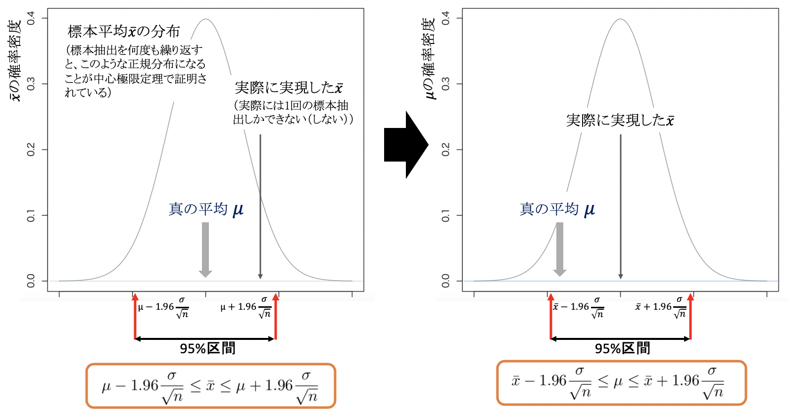
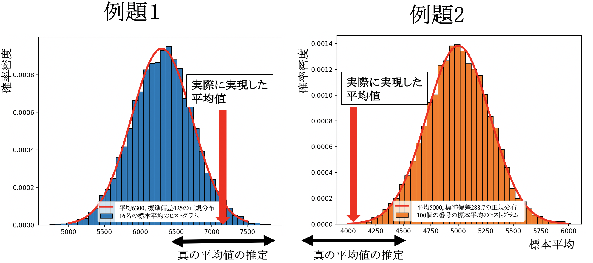

# 医学統計学演習：資料6

芳賀昭弘  
Electronic address: haga@tokushima-u.ac.jp

## 信頼区間の推定

本日は次の例題に沿って「信頼区間の推定」について学びます。

> **例題1：**  
> 日本人の成人男性の1$\mu l$あたりの白血球数の平均値が6300で標準偏差が1700の正規分布をしているとします。ある病気の患者16名のデータを取り出して1$\mu l$あたりの白血球数の平均を求めたところ、その数は7200であった。この病気の患者の白血球数は、日本人の成人男性の平均と差異があると言えるでしょうか？

> **例題2：**  
> 0から10000番まで番号がついたアンケートを配布した。そのうち100枚のアンケートが回収され、番号の平均値が4135であった。回収されたアンケートは小さい番号に偏っていると言えるでしょうか？

前回学んだ中心極限定理は、標本抽出を繰り返すことでその平均値が、正規分布を用いて解析できることを示しています。しかし、実際のほとんどの問題において**標本抽出を繰り返すことなどできない（しない）**でしょう。そんなことが出来るのであれば、母集団全体のデータを調べられるのですから、わざわざ母集団から標本を抽出する必要はありません。

実際の状況は、母集団のうち（なんとかして）その一部のデータを手に入れたという状況でしょう。例題1と例題2でも、得られている結果は一回の標本抽出の結果であり、例題1ではある病気の患者16名の白血球数の平均、例題2では回収された100枚のアンケートの番号の平均、がそれぞれの（たった一回の）標本抽出の結果です。手に入れた一回の標本抽出データから、母集団の性質をどうやって調べるのでしょうか？

それは、中心極限定理を別角度から眺めることで実現できることがわかります。標本抽出を繰り返したデータの平均値の分布から母集団の平均値（真の平均値）を得るのではなく、**たった1回の**標本抽出されたデータの平均値$\bar{x}$から、真の平均値を推定することを考えるのです。

中心極限定理の言っていることは、前節で確かめたように$\bar{x}$は真の平均値$\mu$の周りに図の左のように正規分布に従っているはず、ということです。ここで$n$は標本抽出した数のこと（サンプル数）で、十分に大きな数とします（故に母集団の標準偏差$\sigma$はこの標本の標準偏差で代用可能とする）。$\bar{x}$はこのような確率分布を持って様々な値を取ることができます。1回だけのサンプリングなので、たまたまこの95%の区間から外れるような$\bar{x}$の値を取ることもあって良いでしょう。このときは、$\bar{x}$は真の平均値$\mu$から$1.96\sigma/\sqrt{n}$以上異なってしまうことを意味します。

よって、**たった1回のデータの平均値$\bar{x}$から真の平均値$\mu$を推定する**のであれば、**95%信頼区間**（ここで95%のことを**信頼係数**という）を導入して、

$$
\bar{x}-1.96\frac{\sigma}{\sqrt{n}}
\le \mu \le
\bar{x}+1.96\frac{\sigma}{\sqrt{n}}
$$

の範囲に真の平均値$\mu$が入ってくると考えます。

$n$個のデータをサンプルして平均を求める作業を繰り返すと、同じ手順で作った信頼区間のうち約95%が真の平均値$\mu$を含むということです。変数を標準化する$z=\frac{\bar{x}-\mu}{\sigma/\sqrt{n}}$で表すと、

$$
-1.96
\le z \le
1.96
$$

となります。-1.96, 1.96は、両側5%（下側と上側それぞれ2.5%）を除く下限値と上限値で、Rでは`qnorm(0.025,0,1)`で下限値、`qnorm(0.025,0,1, lower.tail=F)`で上限値を求めることができます。

信頼区間の範囲は、標本抽出を100回行うと何回この範囲に入ってくるかで制御でき、95回ではなく99回（100回に1回は推定が外れる）入ってくる場合には、信頼係数を99%とした信頼区間（**99%信頼区間**）は、$\pm1.96$を$\pm2.58$（`qnorm(0.005,0,1)`と`qnorm(0.005,0,1, lower.tail=F)`）に変えることで得ることができます。

注：1.96や2.58は、確率分布が正規分布のとき（正確にいうと一次元の正規分布）に使うことができる定数です。標準正規分布をそれぞれ$[-1.96,+1.96]$、$[-2.58,+2.58]$の範囲で確率変数を積分することで0.95, 0.99となります。

$$
\bar{x}-2.58\frac{\sigma}{\sqrt{n}}
\le \mu \le
\bar{x}+2.58\frac{\sigma}{\sqrt{n}}
$$

$$
-2.58
\le z \le
2.58
$$

では、具体的に例題1と例題2で95%信頼区間と99%信頼区間を出してみましょう。前回行ったことを思い出しましょう。「もし仮に母集団から標本抽出を繰り返したらどうなるのか？」ということをコンピュータ上でシミュレーションしました（MonteCarlo1.Rを実行してみましょう）。標本抽出を繰り返したら、その平均値は図の赤の曲線で示される正規分布になるのが中心極限定理で、確かにそうなるということを示したわけですが、実際に得られた標本の平均はこれらの分布のどのあたりだったのか赤矢印で示したのが図になります。

ランダムに標本抽出されていれば、その標本の平均は分布の中心付近に来る確率が高いはずですが、特に例題２の方では分布の裾野付近が実現されてしまいました。これを今度は図の右側のように、この実現した平均値の周りに真の分布の平均値がくると視点を変えたのが黒の矢印です。

例題1と例題2におけるこの黒矢印の具体的な範囲は、95%信頼区間に対して式より、

$$
6367
\le \mu \le
8033 \quad (例題1)
$$

$$
3569
\le \mu \le
4701 \quad (例題2)
$$

となります。同様に99%信頼区間に対して式より、

$$
6104
\le \mu \le
8297 \quad (例題1)
$$

$$
3390
\le \mu \le
4880 \quad (例題2)
$$

です。これが「たった一回の標本抽出で求めた標本平均から推定される真の（母集団の）平均値」です。

例題1では、真の平均値は6300でした。これは95%信頼区間からは外れていますが、99%信頼区間には入っています。例題2の真の平均値5000は、95%信頼区間にも99%信頼区間にも入っていません。これをどう解釈すればよいでしょうか？

実は、これにより「標本がランダムにサンプルされているのかどうか」を判定します。ランダムにサンプリングされたのであれば真の平均値に近い値が出るはずなのに、かなり外れた標本平均が得られたということは、何か特別な抽出をしてしまったのではないか、と考えるわけです。

例題1では、「ある病気」の特定の方を抽出しています。「ある病気」の方だけの白血球数を集めて母集団を形成していれば、その平均値は健康な人と合わせた母集団とは異なる性質（平均値や分散など）を持っている可能性が示唆されたことになります。同じく例題2でも100枚のアンケート番号の平均は異常に低い値であって、どうもランダムにサンプリングされたものではなさそうであることが示唆されています。これで例題1（この病気の患者の白血球数は、日本人の成人男性の平均と差異があると言えるでしょうか?）と例題2（回収されたアンケート番号が若い番号に偏っていると言えるでしょうか?）の問いに対して何らかの回答ができそうです。

例えば、例題1では差異がある可能性が示唆される、例題2では若い番号に偏っている確率が**かなり**高い、などと表現できそうです。このように、何%の信頼区間に入っているかといった定量値で例題1や2の問いに回答を与える方法が次に述べる統計的検定になります。次回、ここで行なってきた手順を少し形式張った形で整理したいと思います。

なお、ここまで正規分布でのお話でしたが、確率変数が質的変数であったり連続変数でも正規分布とは異なる確率分布であった場合でも、同じように標本抽出されたデータが実現する確率がそれぞれ95%, 99%である範囲として95%信頼区間や99%信頼区間を定義することができます。後の節でt分布という確率分布が出てきますが、それは**自由度**と呼ばれる変数に応じて信頼区間が異なります。例えば自由度10のt分布の場合、95%信頼区間は$[-2.23,+2.23]$（`qt(0.025,10)`, `qt(0.025,10,lower.tail=F)`）です。

注：自由度は標本抽出する数$n$と関係しています。この$n$が十分大きいときt分布は標準正規分布と一致（当然、信頼区間も一致）します。

信頼区間の考え方がわかってしまえば、他の確率分布への応用も難しくないと思います。中心極限定理があるにも関わらず、正規分布以外の分布への応用も考えなければならない理由は、少数データで且つ母集団が正規分布に従うとは言えない状況があるからです。その時は次週以降に学ぶt分布を使うことになります。

## 演習

1. 平均10、標準偏差が2の正規分布の95%信頼区間と99%信頼区間を求めよ。

2. 平均0、自由度が7の$t$分布の95%信頼区間と99%信頼区間を求めよ。

3. 自由度が1の$\chi^2$分布の下側95%信頼区間と99%信頼区間を求めよ。

4. 例題1で、患者数が25名で他は同じ場合の$\bar{x}$に対する95%信頼区間を求めよ。

5. 上記の問題で、実際に25名の平均値を求めたところその結果が5300だった。この結果をもとに、母集団の平均値の信頼区間を推定せよ。

6. 例題2で、50枚取り出して番号の平均値を求めた時の$\bar{x}$に対する95%信頼区間を求めよ。

7. 上記の問題で、一回だけ50枚取り出して番号の平均値を求めたところその結果が4700だった。この結果をもとに、母集団の平均値の信頼区間を推定せよ。

各問題で使ったRの関数と結果を明示し、解説を付記してください。
