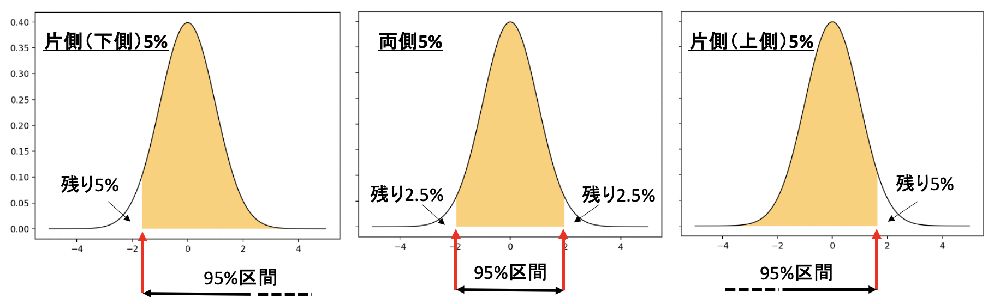

# 医学統計学演習：資料7

芳賀昭弘  
Electronic address: haga@tokushima-u.ac.jp

## 統計的仮説検定

前回、信頼区間の推定について考えました。この推定を**検定**に応用することが本章の目的です。つまり、実際のデータの実現値が、そのデータが本来従うべきと考えた確率分布の信頼区間（一般に95%や99%がよく使われる）に入っているかどうかを調べ、入っていない場合には、従うべきと考えた確率分布に属さないデータであるとみなします。

注：入っている場合には、従うべきと考えた確率分布に属さないデータとは**言えない**、と考えます。

標本データがある確率分布に従っていると仮定することを、**帰無仮説**と呼び、帰無仮説とは逆の仮説を**対立仮説**と呼びます。

こうした仮説を予め設定し、その仮説が正しいとした上で、実際に観察された標本の統計量（平均値など）がどの程度起こりにくい値であるかを調べ、仮説を棄却するかどうかを判断する方法を**統計的仮説検定**と言います。統計的仮説検定は、仮定した確率分布と実際の標本データの間に矛盾がないという仮説から出発します。「矛盾がある」ことを示したい場合でも、まずは「矛盾がない」という仮説（帰無仮説）を立てて、それが矛盾することを証明することで「矛盾がある」ことを示すという論理で進めます。

と、このような言葉だけではなかなかわからないと思いますので、まずは以下に示す基本的な検定の流れを例題に当てはめることで、仮説検定で使われる用語を確認するとともに統計的仮説検定から実際に得られる結果について眺めたいと思います。

### 検定の基本的な流れ

| 手順 | やること |
| --- | --- |
| 1 | 母集団に関する帰無仮説$^{*a}$と対立仮説$^{*b}$の設定。問題の設定の仕方により両側検定$^{*c}$または片側検定$^{*d}$が決まる。 |
| 2 | 検定統計量（$z$値、$t$値、$\chi^2$値、$F$値など）を選ぶ（検定方法を選ぶ） |
| 3 | 有意水準$\alpha$の値を決める |
| 4 | データの検定統計量の実現値を求める |
| 5 | 検定統計量の実現値が棄却域に入れば帰無仮説を棄却し、対立仮説を支持する。 |

$a$：「差がない」「効果がない」という仮説を設けること。$H_0$という記号を使う。  
$b$：帰無仮説とは逆（「差がある」「効果がある」）の仮説。$H_1$という記号を使う。  
$c$：差があるかどうかを知ることが重要であり、どちら（どれ）が「大きい」or「小さい」のかは気にしない。  
$d$：ある集団より別の集団の方が「大きい」or「小さい」ことを知りたい場合。



### 標準正規分布を用いた検定

**母集団の性質（平均値や分散）がわかっている、もしくは母集団の分散が不明でもサンプル数が大きい場合に利用できる検定。**

> **例題1：**  
> あるゲームの得点について、平均点が1024で標準偏差が256である正規分布となることが調べられている。そのゲームで4回行った平均が1250点であった時、そのゲームについて得意・不得意であると言ってよいでしょうか？有意水準を5%として検定せよ。

（手順）

帰無仮説$H_0$：4回の平均1250点は、平均1024、標準偏差256の正規分布に従う母集団から得られた標本平均として矛盾しない。  
（対立仮説$H_1$：平均1024、標準偏差256の分布に従う母集団から得られた標本平均としては考えにくい）

検定統計量：$z$値（標準正規分布の変数）。ここで$z=\frac{(x-\mu)}{\sigma / \sqrt{n}}$で、$\mu$、$\sigma$はそれぞれ母集団の平均値と標準偏差。$n$はサンプル数。

有意水準：両側5%とする

検定統計量の実現値：

```r
# z <- (*** - ***) / (***)
# pnorm(z)
```

＿＿＿＿＿＿＿＿

$z$分布の両側5%における限界値

＿＿＿＿＿＿＿＿

$p$値が＿＿＿＿＿＿＿＿であり、統計検定量は有意水準＿＿＿＿である。  
よって帰無仮説は＿＿＿＿＿＿＿＿＿＿＿＿。

> **例題2：**  
> 0から10000番まで番号がついたアンケートを配布した。そのうち100枚のアンケートが回収され、番号の平均値が4135であった。回収されたアンケートはランダムにサンプルされていると言えるでしょうか？  
> （ヒント：母集団0$\sim$10000を全て使って解析可能（平均値や分散も求めることができる）なので、母集団の性質がわかっている場合に利用できる検定を使う）

（手順）

帰無仮説$H_0$：回収されたアンケートはランダムに抽出された $\rightarrow$ 100枚のアンケート番号の標本平均は、母平均5000の周りにランダムに分布する。  
（対立仮説$H_1$：100枚のアンケート番号の標本平均は、母平均5000の周りにランダムに分布しているとは考えにくい）

検定統計量：$z$値（標準正規分布の変数）。ここで$z=\frac{(x-\mu)}{\sigma / \sqrt{n}}$で、$\mu$、$\sigma$はそれぞれ母集団の平均値と標準偏差。$n$はサンプル数。

有意水準：両側5%とする

検定統計量の実現値：

```r
# z <- (*** - ***) / (***)
# pnorm(z)
```

＿＿＿＿＿＿＿＿

$p$値が＿＿＿＿＿＿＿＿であり、統計検定量は有意水準＿＿＿＿である。  
よって帰無仮説は＿＿＿＿＿＿＿＿＿＿＿＿。

### t分布を用いた検定

**母集団の分散がわからずサンプルが少数である場合に利用できる検定。**

> **例題3：**  
> A社の放射線治療装置を購入した場合、1時間当たり4名以上の治療が可能であれば採算がとれるという。近隣の5つの病院では、A社の放射線治療装置を用いて1時間当たり平均4.6名、標準偏差0.6名という結果が得られていた。A社の放射線治療装置を購入すべきかどうかを判定せよ。

（考え方）5つの病院（標本）での平均が4.6名、標準偏差0.6名という結果は、統計学的に確かに4名以上（大もとの母集団の平均が4名以上）で治療可能と言えるのか？

（手順）

帰無仮説$H_0$：A社の新型放射線治療装置による治療可能件数は1時間当たり4名である（対立仮説$H_1$：4名を超える）

検定統計量：$t$値（t分布の変数）。ここで自由度$n-1$の$t$分布は（$n$はサンプル数）

$$
t=\frac{x-\mu}{s/\sqrt{n-1}}=\frac{x-\mu}{\hat{\sigma}/\sqrt{n}}
$$

である（$\mu$は母集団の平均、$s$は標本標準偏差）。これを使って母集団の平均を推定する。

有意水準：片側5%とする

統計量の実現値：

まず片側5%の確率となる$t$値の限界値は

```r
t_5 <- qt(***, 4, lower.tail = FALSE)
```

で与えられる（`***`には何が入りますか？）。

この値を上の式に代入して$\mu$を求めると、

```r
4.6 - t_5 * 0.6 / sqrt(4)
```

＿＿＿＿＿＿＿＿

これは、サンプルの標本平均値と標本標準偏差から推定された下側95%信頼区間の下限の治療人数である。この推定から採算が取れると確実に言えるでしょうか？  
（4.6名というのは、どの程度の``確実"な結果なのだろうか？$\rightarrow$ 演習）

**相関係数の検定に利用できる検定。**

> **例題4：**  
> 密度がわかっている7つの物質をCTで撮影したところ、CT値（画像上での濃淡を表す信号値）は次のようなデータとなった。

密度 0.26, 0.52, 0.93, 1.0, 1.25, 1.46, 1.92  
CT値 -817, -522, -90, 0, 491, 741, 1547

密度とCT値に相関があると言えるか？

（手順）

帰無仮説$H_0$：$\rho = 0$、すなわち母相関はない（対立仮説$H_1$：$\rho \ne 0$、すなわち母相関がある）

検定統計量：$t$値。なぜなら$r$を相関係数とすると、$t=\frac{r\sqrt{n-2}}{\sqrt{1-r^2}}$は自由度$n-2$のt分布となる。

有意水準：両側$a$%とする

```r
dens <- c(0.26, 0.52, 0.93, 1, 1.25, 1.46, 1.92)
ct <- c(-817, -522, -90, 0, 491, 741, 1547)
plot(dens, ct)
r <- cor(dens, ct)
n <- length(dens)
# tvalue <- r * sqrt(n - 2) / sqrt(1 - r^2)
tvalue <- ______
2 * pt(abs(tvalue), n - 2, lower.tail = FALSE)
```

＿＿＿＿＿＿＿＿

$p$値が＿＿＿＿＿＿＿＿であるので、統計検定量は有意水準＿＿＿＿である。  
よって帰無仮説は＿＿＿＿＿＿＿＿＿＿＿＿。

なお、相関係数の検定には、`cor.test`関数が用意されている：

```r
cor.test(dens, ct, conf.level = 0.95)
```

上と同じ結果が与えられていることを確認できたでしょうか？

## 演習

1. 例題3で有意水準をいくらに設定すると、4名という結果が得られるか？  
   （つまり、p値はいくらであるか？）

2. ある血液の$\mu L$辺りの白血球数を5回測定したところ、  
   5623, 5887, 5054, 6289, 6003  
   という観測値が得られた。真の白血球数[個 /$\mu L$]の95%信頼区間及び99%信頼区間を求めよ。

   ヒント：

   自由度$n-1$の$t$分布は

   $$
   t=\frac{x-\mu}{s/\sqrt{n-1}}=\frac{x-\mu}{\hat{\sigma}/\sqrt{n}}
   $$

   である（$\mu$は母集団平均、$s$は標本標準偏差、$\hat{\sigma}$は不偏標準偏差）。

   95%信頼区間を与える$t$値（上側）は、

   ```r
   p95level <- qt(0.025, 4, lower.tail = FALSE)
   ```

   99%信頼区間を与える$t$値（上側）は、

   ```r
   p99level <- qt(0.005, 4, lower.tail = FALSE)
   ```

   したがって、

   $$
   -\mathrm{p95level} < \frac{x-\mu}{s/\sqrt{n-1}} < \mathrm{p95level}
   $$

   これを$\mu$について解くと、真の白血球数[個 /$\mu L$]の95%信頼区間が得られる（99%信頼区間も同様に求める）。

3. 点数は正規分布に従い、過去のデータから、あるテストの平均値は60であることがわかっている。今回20名でそのテストを実施したところ、平均値が65、標本分散が8であった。この20名は、過去の人たちと同じ母集団からの無作為標本と考えてもよいか？

   （手順）

   帰無仮説$H_0$：無作為標本と考えて良い。  
   検定統計量：$t$値（母集団の標準偏差が不明でサンプルもそれほど多くはない）。  
   有意水準：両側5%とする。
