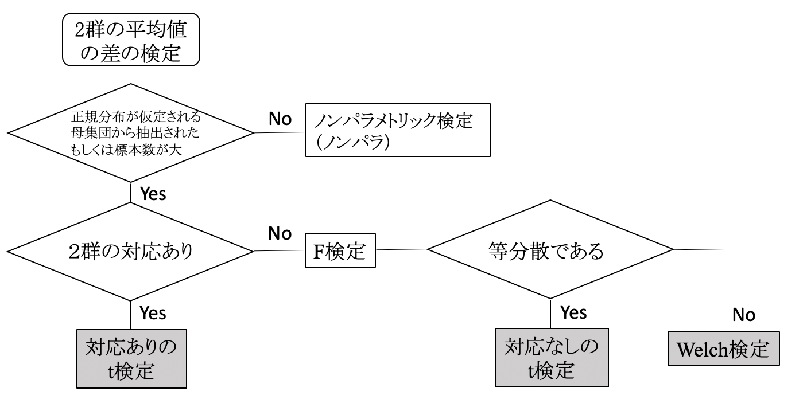

# 医学統計学演習：資料9

芳賀昭弘  
Electronic address: haga@tokushima-u.ac.jp

## 前回演習解答

1. 例題3で症例数を$x$倍したが、同じ割合の効果であった。

   |  | 治療A | 治療B | 計 |
   | --- | ---: | ---: | ---: |
   | 有効（P） | $10x$ | $26x$ | $36x$ |
   | 無効（N） | $10x$ | $14x$ | $24x$ |
   | 計 | $20x$ | $40x$ | $60x$ |

   治療Aと治療Bに差が出る$x$を求めてください（症例数を$x$倍すると、差が出てしまいます！）

2. ある理論によると、放射線のカウントが

   12, 22, 22, 35, 22, 32, 27, 27, 17, 36

   となるが、実際には

   14, 21, 25, 31, 23, 27, 26, 27, 29, 29

   であった。この理論は実験で観測された放射線のカウントを予測できていると言えるでしょうか？

## 復習

1. 両側検定で95%の信頼区間を与える$z$値、$t$値（自由度4）、片側検定で$\chi^2$値（自由度5）はいくらか？

   ```r
   qnorm(0.025)
   qnorm(0.975)
   qnorm(0.025, lower.tail = FALSE)
   qt(0.025, 4)
   qt(0.975, 4)
   qt(0.025, 4, lower.tail = FALSE)
   qchisq(0.95, 5)
   ```

2. ある血液の$\mu L$辺りの白血球数を5回測定したところ、

   6623, 6887, 7054, 6289, 7003

   という観測値が得られた。真の白血球数[個 /$\mu L$]の95%信頼区間を求めよ。

   ```r
   data <- c(6623, 6887, 7054, 6289, 7003)
   p95level <- qt(0.025, 4, lower.tail = FALSE)
   mean(data) - p95level * sd(data) / sqrt(5)
   mean(data) + p95level * sd(data) / sqrt(5)
   ```

3. 点数は正規分布に従い、過去のデータから、あるテストの平均値は60であることがわかっている。今回20名でそのテストを実施したところ、平均値が65、標本分散が8であった。この20名は、過去の人たちと同じ母集団からの無作為標本と考えてもよいか？

   ```r
   tval <- (65 - 60) / (sqrt(8) / sqrt(20 - 1))
   2 * pt(abs(tval), 19, lower.tail = FALSE)
   ```

## 二つのグループ（標本）の平均値の差

復習の問題のように、これまでは取り出した標本が母集団の性質（平均や分散など）と一致しているかどうかを調べる検定（**標本ー母集団**の比較）を考えてきました。これは母集団の性質がわかっていることが前提となりますが、そのようなケースは稀です。

また、調べたい標本のほとんどは、ランダムに抽出されたグループではなく興味を持つある特定のグループでしょう。そのため、調べたい標本とともに、それと比較するための対照群を用意して、この二つのグループ（2群）の平均値に差があるかどうかを検定できると便利でしょう（**標本ー標本**の比較）。

注：より正確に言うと、2つの標本が同じ母集団から抽出されたのかどうかを検定します。



本節で学ぶ2群の平均値の検定の流れを図に示します。ここでは2群の大元である母集団が「正規分布である」ことを仮定するのですが、このように母集団の分布がある特定の確率分布に従っていると仮定して検定を行うことを**パラメトリック検定**と呼び、他方、母集団の分布を特に仮定しない検定をパラメトリック検定と対比的に**ノンパラメトリック検定（ノンパラ）**と呼びます。

パラメトリック検定の場合、検定を行う時に満たさなければならない条件があることになります。今回用いる2群の平均値の差に対するt検定では次の条件が満たされなければなりません。

1. 間隔データ、比率データのような量的データであること。
2. 2群とも母集団が正規分布に従っていること（正規性）。
3. 2群の母集団の分散が等しいこと（等分散性）。

上記1.の通り、t検定は数値データに基づいています。2.の正規性については、標本が30以上あるような場合であれば母集団自体が正規分布に従わない場合でも中心極限定理より標本平均の値は正規分布と近似できるようになりますので、あまり心配は要らないでしょう。

3.についてですが、まず、2つの群の分散の違いを調べる必要があります。それには**F検定**という検定を用います。このF検定で**分散の違いがみられなければ**、t検定を用いて2群の平均値の差を検定します。しかし、もし分散の違いがみられた場合はどうすれば良いでしょうか？その場合には、自由度の値を補正したt検定で近似的に求めます。この検定を**Welchの検定**と言います。

それでは、まず、標本間に対応がある場合の2群の平均の差の検定についてまとめます。

対応のあるt検定では、2群の標本が``対応"していなければなりません。つまり、一方の標本を抽出したら他方にもその標本を適用します。

例えば、同じ被験者に薬を処方し、服薬してもらう前後の血液データのペアは``対応のあるデータ"とみなします。また、双子ペアが10組（20名）あり、そのペアの一方を第1群（10名）、もう一方を第2群（10名）に分けて取られたデータはやはり``対応のあるデータ"とみなすことができます。この場合は、次のようにペアの差から得られる$t$値を計算し、t分布の信頼区間から外れているかどうかで検定を実施できます。

命題：二つの標本の差の平均を$\bar{d}$、その不偏標準偏差を$\hat{\sigma}$として、

$$
t=\frac{\bar{d}}{\hat{\sigma}/\sqrt{n}}
$$

は自由度$n-1$のt分布に従う（ここで$n$は標本数）。

次に対応のない場合の2群の平均の差の検定についてまとめます。

命題：同じ分散である2つの母集団${\cal N}(\mu_1, \sigma^2)$、${\cal N}(\mu_2, \sigma^2)$からの標本$(x_1, x_2, \cdots, x_m)$、$(y_1, y_2, \cdots, y_n)$に対して、

$$
t=
\sqrt{\frac{mn(m+n-2)}{m+n}}
\frac{(\bar{x}-\bar{y})-(\mu_1-\mu_2)}
{\sqrt{ms_x^2+ns_y^2}}
$$

の標本分布は自由度$m+n-2$のt分布に従う。もし母集団の分散が異なる場合には、Welch法で近似する。この場合、

$$
t=
\frac{{\cal N}(0,1)}{\sqrt{\chi^2_\nu/\nu}}
$$

ここで、

$$
\nu=
\frac{(\sigma_x^2/m+\sigma_y^2/n)^2}
{(\sigma_x^2/m)^2/(m-1)+(\sigma_y^2/n)^2/(n-1)}
$$

となる。

**母集団が正規分布であるという条件において**、2つの標本の平均値の差の検定には、上記のどちらかを使うことになります。いずれもt分布ですね。

## 対応のあるt検定

双子のペアが10組あり、そのペアの一方を第1群、もう一方を第2群に分けて取られたデータは、``対応のあるデータ"と考えられます。

また、同じ被験者に薬を処方し、服薬してもらう前後の血液データなども``対応のあるデータ"とみなします。その場合、ペアごとの差の平均に対して上の対応のあるt検定の式を使ったt検定を行うことになります。

> **例題1：**  
> EOM2.csvを読み込み、投与前後のデータに差があるか検定せよ。

帰無仮説$H_0$：投与前後のデータに差がない。  
検定統計量：対応のあるt検定で定義されるt値。  
有意水準：両側5%とする。

```r
t.test(data$Before, data$Just.after, paired = TRUE)
```

$p$値が＿＿＿＿＿＿＿＿であるので、統計検定量は有意水準＿＿＿＿であり、帰無仮説は＿＿＿＿＿＿＿＿＿＿＿＿。

```r
t.test(data$Before, data$One.hr.after, paired = TRUE)
```

$p$値が＿＿＿＿＿＿＿＿であるので、統計検定量は有意水準＿＿＿＿であり、帰無仮説は＿＿＿＿＿＿＿＿＿＿＿＿。

Rでは`t.test`という関数が用意されており、これで簡単にt検定を行うことができる。対応のないt検定では、オプションである`var.equal = TRUE`を分散が同じ場合に使用する（このオプションをつけないと、Welchのt検定が行われる）。

## 対応のないt検定

前節の対応のあるデータとは対照的に、データをランダムに2群に割り振ったようなデータは、独立な2群とか、対応のない2群と言えます。この場合、データ（の母集団）の等分散性が保証されないため、まず、**分散の等質性の検定**を行います。分散の等質性は、F分布により検定が可能でした。Rでは、`var.test`関数によって検定を簡単に行うことができます。

> **例題2：**  
> 次のクラスAとクラスBの平均点に有意な差があるでしょうか？有意水準5%で検定を行ってください。

|  | 1 | 2 | 3 | 4 | 5 | 6 | 7 | 8 | 9 | 10 |
| --- | ---: | ---: | ---: | ---: | ---: | ---: | ---: | ---: | ---: | ---: |
| クラスA | 54 | 55 | 52 | 48 | 50 | 38 | 41 | 40 | 53 | 52 |
| クラスB | 67 | 63 | 50 | 60 | 61 | 69 | 43 | 58 | 36 | 29 |

まず、F検定を行います。

```r
classA <- c(54, 55, 52, 48, 50, 38, 41, 40, 53, 52)
classB <- c(67, 63, 50, 60, 61, 69, 43, 58, 36, 29)
var.test(classA, classB)
```

### 分散が等しい場合

例題2において分散が等しいと検定された場合には、

```r
t.test(classA, classB, var.equal = TRUE)
```

を行う。

### 分散が等しくない場合

実際には、例題2の検定では分散が等しくないと検定されます。その場合、Welch法を使います。Welchのt検定などと呼んでいます。やることは上と同じで`t.test`を使いますが、`var.equal = TRUE`のオプションをとってください。

```r
t.test(classA, classB)
```

$p$値が＿＿＿＿＿＿＿＿であるので、統計検定量は有意水準＿＿＿＿であり、帰無仮説は＿＿＿＿＿＿＿＿＿＿＿＿。

### 補足：ノンパラメトリック検定

ウィルコクソンの順位和検定（マン・ホイットニーのU検定）、ウィルコクソンの符号順位検定、Brunner-Munzel検定について補足します。

2群の差の検定において母集団が正規分布に従わないことがわかっている場合、$t$検定ではなくウィルコクソンの順位和検定を行います。分布の形が似ている場合には、2群の位置の差を調べる検定として解釈できます。`wilcox.test`を使います。

2群の平均値の差に関する$t$検定は母集団の分布が正規分布であることを仮定していましたが、ウィルコクソンの順位和検定は母集団の正規分布性を仮定する必要がないため、より汎用性が高い検定法と言えます。ただし、分布の形が大きく異なる場合には、単純に中央値の差の検定とは解釈できないことに注意しましょう。

分布の形や分散が異なる場合にはBrunner-Munzel検定を使うことができます。`brunner.munzel.test`を使います。

対応あり（対応のあるデータを用いる場合）：

```r
wilcox.test(classA, classB, exact = FALSE, paired = TRUE)
```

対応なし：

```r
wilcox.test(classA, classB, exact = FALSE)
```

対応なしで非等分散：

```r
library(lawstat)
brunner.munzel.test(classA, classB)
```

Brunner-Munzel検定を使うために`library(lawstat)`を読み込んでいます。インストールされていなければ次でインストールしてください（この作業は使用する最初の1回だけで良い）。

```r
install.packages("lawstat")
```

## 演習

1. 医学部の教育方法として、講義型（L）、実習型（E）の2つの形態による理解度の違いを調べた。それぞれの授業に参加した学生7名（A$\sim$G）をランダムに抽出し、最終テストの得点で比較することにした。

   1. これは対応ありですか？対応なしですか？（どちらを選んでも理由が間違いでなければ正答）
   2. 1.の下、それぞれの母集団が正規性を満たして**いる**として、LとEに差があるか評価せよ。
   3. 1.の下、それぞれの母集団が正規性を満たして**いない**として、LとEに差があるか評価せよ。

   | Student | A | B | C | D | E | F | G |
   | --- | ---: | ---: | ---: | ---: | ---: | ---: | ---: |
   | L | 51 | 66 | 70 | 75 | 73 | 62 | 55 |
   | E | 55 | 37 | 47 | 60 | 62 | 53 | 50 |

2. 平均0、分散1の正規分布を持つ母集団Aと平均0.1、分散1の正規分布を持つ母集団Bがある。AとBから`rnorm`で10個、100個、1000個とサンプル数を増やしていき、A, Bのサンプル平均の差を検定せよ。必要に応じて`set.seed`を使い、結果を再現できるようにしておく。

   Rに入力したコマンド（スクリプト）、対応する出力をmanabaに貼り付けるとともに、考察もすること。

   考察へのヒント：元々の母集団は異なっている点を踏まえましょう。サンプル数を増やすと、差が出るようになる？
