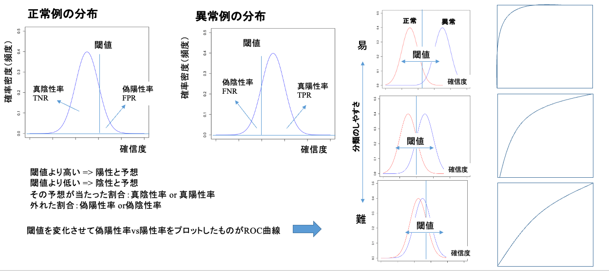
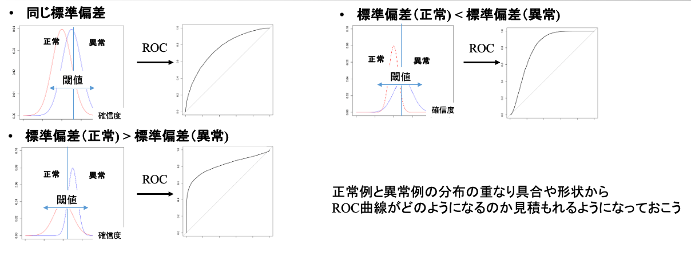

# 医学統計学演習：資料11

芳賀昭弘  
Electronic address: haga@tokushima-u.ac.jp

## ROC解析と推論の評価

「健康・病気」などのような2つの値（二値）をとる事象を考えます。そしてこれを検診の「白血球数」から予測することを考えてください。白血球数がある基準範囲内であれば健康、外れるようであれば病気と予測するとしましょう。

検査結果で病気が疑われるケースを**陽性**、疑われないケースを**陰性**と言います。この陽性と陰性を分ける点を**カットオフ値**（**閾値**）と呼びます。例えば、検査による白血球数を$x$、日本人成年男性の中央値を$m$として$|x-m|<c$を基準範囲とすると、この$c$がカットオフ値となります。この値を極端にとれば、被検者の多くを陽性とすることもできますし、逆にその多くを陰性とすることもできます。

被検者の多くを陽性とするようなカットオフ値では、実際に病気でない人を病気と判定することで（これを**偽陽性**という）さらなる検査を要請することになり資源の無駄や被検者の負担を増やしてしまいます。逆に陰性に偏るようなカットオフ値では、偽陽性は少なくなりますが、本当は病気なのに誤って健康と判定する（これを**偽陰性**という）ことを避けることができなくなります。適切なカットオフ値を決めることは重要であることがわかります。

また、「白血球数」に加えて「血小板数」も病気の予測に用いた場合、予測の精度は増すでしょうか？このように二値推論の複数のモデルを比較することでより良い予測モデルを定量的に評価したいことがあります。カットオフ値による予測性能の変化の振る舞いや推論モデルの比較に使われるのがReceiver Operating Characteristic (ROC) curve（ROC曲線）です。

実際起こった現象と予測の結果を比較する場合、次の$2 \times 2$分割表（**混同行列**）を使うとわかりやすくなります。ROC曲線は、閾値を変えながら混同行列を作成し、偽陽性率を横軸に真陽性率（感度）をプロットすると描くことができます。

表：混同行列

|  |  | 実際 |  |
| --- | --- | --- | --- |
|  |  | 真 | 偽 |
| 予測 | 真 | 真陽性 | 偽陽性 |
|  | 偽 | 偽陰性 | 真陰性 |

- **感度** Sensitivity：真陽性/(真陽性 + 偽陰性)（実際が真の中で、予測が真の割合）
- **特異度** Specificity：真陰性/(偽陽性 + 真陰性)（実際が偽の中で、予測が偽の割合）
- **陽性的中率** Positive Predictive Value：真陽性/(真陽性 + 偽陽性)（予測が真のうち、実際に真の割合）
- **陰性的中率** Negative Predictive Value：真陰性/(偽陰性 + 真陰性)（予測が偽のうち、実際に偽の割合）
- **オッズ比** Odds Ratio：(真陽性/偽陰性)/(偽陽性/真陰性)
- **相対危険度** Risk Ratio：真陽性/(真陽性 + 偽陽性) / 偽陰性/(偽陰性 + 真陰性)（予測陽性群と予測陰性群における実際の陽性割合の比）

## ROC曲線の描画

**横軸を偽陽性率、縦軸を真陽性率（感度）として閾値を変えてプロットしたものがROC曲線です**。それでは今回も例題を通してROC曲線の描画にチャレンジしてみましょう。

表の「模試（入試3ヶ月前）の点数 vs. 入試結果」と「模試（入試1ヶ月前）の点数 vs. 入試結果」を使って2つのROC曲線を描いてください。

解答を見ておきましょう。図の赤線が入試3ヶ月前、青線が入試1ヶ月前の点数に基づいたROC曲線です。これを描くために、この図の右側に示してある表のように、模試の点数に閾値を設定し、その閾値によって真の合格者のうち何名を検知できたか（真陽性率=感度）と真の不合格者のうち何名を誤って合格者としてしまうか（偽陽性率=1-特異度）を算出します。あとは縦軸の真陽性率を横軸の偽陽性率に対してプロットすることでここで示されたROC曲線を得ることができます。

表：模試の点数による実際の試験の合格者の予測

| 模試（入試3ヶ月前）の点数 | 入試結果 | 模試（入試1ヶ月前）の点数 | 入試結果 |
| ---: | --- | ---: | --- |
| 100 | 合格 | 100 | 合格 |
| 90 | 合格 | 90 | 合格 |
| 80 | 不合格 | 80 | 合格 |
| 70 | 合格 | 70 | 合格 |
| 60 | 不合格 | 60 | 不合格 |
| 50 | 合格 | 50 | 合格 |
| 40 | 不合格 | 40 | 不合格 |
| 30 | 合格 | 30 | 不合格 |
| 20 | 不合格 | 20 | 不合格 |
| 10 | 不合格 | 10 | 不合格 |
| 0 | 不合格 | 0 | 不合格 |


模試の点数によって実際の試験の合格者はどのくらい正確に予測できたのか、ということをこのROC曲線から評価してみましょう。まず、閾値を幾つに設定すると合格・不合格をよりよく予測できるでしょうか？

これに対しては、Balanced Error Rate (BER)という指標が時々使われます。予測の誤りは偽陽性率と偽陰性率の2通りがありますが、BERはその平均（（偽陽性率+偽陰性率）/2）で与えられます。これは**誤分類率**を意味しており、BERを最小にする閾値が間違いの少ない閾値であるという考え方に則っています。

注：実際に合格した人を不合格と予測すること（偽陰性）と、実際に不合格だった人を合格と予測すること（偽陽性）では、間違いの深刻さが異なることがあります。例えば、がん検査では、がんではない人をがんと判定する偽陽性より、がんである人をがんではないと判定する偽陰性の方が深刻になり得ます。このような場合には、BERではなく、偽陽性率と偽陰性率に重みを掛けて加える損失関数を用いる方がよいと考えられます。

ROC曲線を積分したもの（曲線の下の領域の面積）を**Area Under the Curve (AUC)**といい、モデルの予測性能を定量的に評価するときに便利です。今の例では、模試（入試3ヶ月前）の点数と模試（入試1ヶ月前）の点数が予測モデルであり、AUCはそれぞれ0.8と0.966...です。AUCは最大が1であり、1に近いほど予測性能が良いと言えることになります。今回の例では、模試（入試1ヶ月前）の点数で入試の合否を予測するモデルの方が優れていると言えます。

## 確信度

上記の例で、模試の点数が高い場合には実際の試験では合格する確率は高くなるだろうことが期待されると思います。したがって、この模試の点数が試験に合格する「確信度」を与えていると考えることができます。

別の例で、肺野のX線レントゲン画像からがんをスクリーニングする過程において、がんであるかどうかを人が見て推定する際に10段階で評価したとします。0が正常で、10はがんであると最も確信して推定しているとすると、この10段階評価が確信度を表していると言えます。

ただし、がんと思っても正常だったり（偽陽性）、正常と思ったが実際にはがんであったり（偽陰性）と、間違えることはあるでしょう。実際に正常症例を集めて、それで評価した確信度の分布と、異常症例を集めて同じく確信度を分布化したものが次の図の左に示されています。あるところに閾値を設定し、その閾値以上ががん、それ未満が正常というようにすると、図のように真陰性率TNR、偽陽性率FPR、真陽性率TPR、偽陰性率FNRが図に示されている部分（積分領域）になることがわかります。

ROC曲線はこの2つの曲線を同時にプロットし、閾値を設定して作成されていることに気づくと思います。また、互いに分布が離れていればROC曲線のAUCは大きく、試験の合否やがんと正常の識別が容易であり、逆に分布が重なっていると、それらの識別が困難になってくることもわかります。



図には、正常症例と異常症例の分布の形状（特に標準偏差）の違いによるROC曲線の形状変化を示しています。これらのROC曲線の振る舞いは、左側の分布と閾値の関係から導くことができるので、ROC曲線の作成過程をしっかりと身につけておきましょう。



## pROCによるROC解析

最後に`pROC`もしくは`ROCR`というライブラリを使ったRによるROC解析の例を示しておきます。`pROC`ライブラリのインストールは次のようにします。

```r
install.packages("pROC")
```

既にインストールされているようであれば行う必要はありません。`pROC`を使うには次のライブラリ関数で`pROC`ライブラリを読み込みます。

```r
library(pROC)
```

この`library(pROC)`はROC解析をする時に毎回宣言しなければならないことに注意しておいてください。

それでは、`Point`に模試（入試3ヶ月前）の点数を、`Class`に合否（合格を1, 不合格を0）を登録し、`pROC`ライブラリの`roc`関数を使ってROC曲線を書かせてみましょう。

注：ここで不合格を1、合格を0とすると異なる結果が得られます。通常、予想に使う値が大きい$\rightarrow$陽性という対応で考えますが、今回は模試の点数が大きい$\rightarrow$陽性（合格）という対応で考えています。本来の陽性を何にするかによってROC曲線やAUCが変わることがあります。入力するデータと結果に整合性があるかどうかを確かめながら解析を行う必要があります。

```r
Point <- c(0, 10, 20, 30, 40, 50, 60, 70, 80, 90, 100)
Class <- c(0, 0, 0, 1, 0, 1, 0, 1, 0, 1, 1)
ROC1 <- roc(Class, predictor = Point, levels = c(0, 1), direction = "<")
plot(ROC1, col = "Red", legacy.axes = TRUE)
```

図の赤線を書かせることができたと思います。4行目でROC解析を実施しています。`levels = c(0, 1)`は0を陰性、1を陽性として扱うという指定です。`direction = "<"`は、予測に使う値（ここでは模試の点数）が大きいほど陽性（合格）らしい、という向きを指定しています。

5行目では`legacy.axes = TRUE`を指定し、横軸を1-Specificity（偽陽性率）、縦軸をSensitivity（真陽性率）としてプロットしています。AUCは以下で確認できます。

```r
ROC1
```

なお、2つのROC曲線に差があるかどうかを検定する方法としてdelong検定というものがあり、`pROC`では関数が用意されている。模試（入試1ヶ月前）の点数についてのROC解析を実施し、それを`ROC2`として保存しているとしよう。`ROC1`と`ROC2`の両者に差があるかどうかを検定するには、次のようにすればよい。

```r
roc.test(ROC1, ROC2, method = "delong", alternative = "two.sided")
```

## ROCRによるROC解析

`ROCR`ライブラリのインストールは次のようにします。

```r
install.packages("ROCR")
```

インストールしたら、次のライブラリ関数で`ROCR`ライブラリを読み込みます。

```r
library(ROCR)
```

この`library(ROCR)`はROC解析をする時に初めに宣言しなければならないことに注意しておいてください。

それでは、`Point`に模試（入試3ヶ月前）の点数を、`Class`に合否（合格を1, 不合格を0）を登録し、`ROCR`ライブラリの関数`prediction`や`performance`を使ってROC曲線を書かせてみましょう。

```r
Point <- c(0, 10, 20, 30, 40, 50, 60, 70, 80, 90, 100)
Class <- c(0, 0, 0, 1, 0, 1, 0, 1, 0, 1, 1)
pred <- prediction(Point, Class)
perf <- performance(pred, "tpr", "fpr")
plot(perf, col = "Red", lwd = 2)
```

同じく図の赤線を書かせることができたと思います。4行目の`"tpr"`と`"fpr"`は真陽性率（true positive rate）と偽陽性率（false positive rate）のことです。5行目で縦軸を`tpr`、横軸を`fpr`としてプロットしています。

AUCは次のようにして計算することができます。

```r
auc.tmp <- performance(pred, "auc")
as.numeric(auc.tmp@y.values)
```

ここでは模試の点数による合否の予測という例でROC曲線とその解析について説明しました。模試の点数をもっと複雑なモデルにすることで人工知能っぽくすることができます。例えば、模試の点数も1つの模試だけではなく過去に受けた模試の点数の時系列データや性別・年齢・居住地域・親の年収・学生時代の部活動等々を入力にして合格確率を出力するモデルを作ったとします。このモデルの性能は、モデルの合格確率と実際の合否でROC曲線を描かせることで模試の点数単独のモデルと同じように評価・比較することができます。

## 演習

1. `E_11_ROC.csv`をダウンロードし、Histologyに対する項目EnergyのROC解析を実施し、そのAUCを求めよ。
2. 上記の解析において、Cutoff=0.5及びBERを最小とした時の感度と特異度を求めよ。
3. 最もAUCの値が大きくなる項目を探索せよ（Rスクリプトでfor文を使って一気に計算するスクリプトを作成し、manabaに貼り付けること）。
