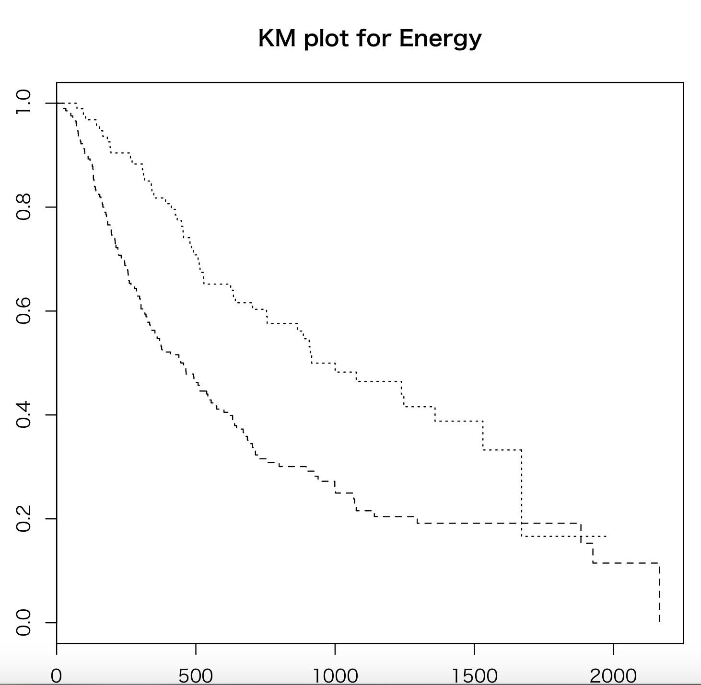

# 医学統計学演習：資料12

芳賀昭弘  
Electronic address: haga@tokushima-u.ac.jp

## 生存分析

医療では、データを一斉に生成し、観測するということはまず不可能です。症例の発症、診断のタイミング、研究対象として症例を登録するという時期もバラバラになることが多くあります。また症例の発生に長い時間を要するものもあります。

そのように、対象の登録時点が異なるものであっても、また、事象の発生（イベントの発生、アウトカム、等々という）が一部の症例でしか起きていなくても、解析可能であるような方法が望まれます。その代表がカプラン・マイヤー（Kaplan-Meier: KM）法です。

KM法に必要なデータ：**経過時間と打ち切り**

経過時間とは、症例の登録時点からアウトカム発生までの時間、または打ち切りまでの時間です。症例登録の時点としては、手術日、治療終了日などをとることが多いです。

打ち切りとは、期間内のアウトカム発生の有無以外に、様々な理由で研究対象から除かれる症例があり、それを打ち切りというものです。例えば、患者が来なくなった、別の要因で亡くなった、などです。以下で使用する`E12_Survival1.csv`では、打ち切りを1、イベント（死亡）を0としている一方、`E12_Lung1dataset.csv`では逆に死亡を1、打ち切りを0としています。Rの`Surv()`関数では、イベントが発生した症例が`TRUE`になるように指定する必要があります。

## 生存曲線のプロット

データ例と手計算による解析例

| 経過時間[day] | censor（0=イベント, 1=打ち切り） | $i$ | $n_i$ | $e_i$ | $q_i$ | $p_i$ | $s_i$ |
| ---: | ---: | ---: | ---: | ---: | --- | --- | --- |
| 301 | 0 | 1 | 9 | 1 | 1/9 | 8/9 | 8/9 |
| 565 | 1 |  |  |  |  |  |  |
| 638 | 0 | 2 | 7 | 2 | 2/7 | 5/7 | $8/9 \times 5/7$ |
| 638 | 0 |  |  |  |  |  |  |
| 729 | 1 |  |  |  |  |  |  |
| 866 | 0 | 3 | 4 | 1 | 1/4 | 3/4 | $8/9 \times 5/7 \times 3/4$ |
| 868 | 1 |  |  |  |  |  |  |
| 1196 | 1 |  |  |  |  |  |  |
| 1319 | 1 |  |  |  |  |  |  |

ここで$i$はイベント発生の順番、$n_i$はアウトカムが発生していない数、$e_i$は各期間のアウトカム発生症例数、$q_i$はアウトカム発生率、$p_i$はアウトカムが発生しない率、$s_i$は累積生存率です。経過時間に対する累積生存率のプロットが、生存曲線となります。

Rでは、経過時間と打ち切りのデータがあれば、簡単に生存曲線を描かせることができます。次のようにします。データは`E12_Survival1.csv`を使ってください（上の例と同じデータです）。

```r
library(survival)
data <- read.csv("E12_Survival1.csv")
data
kp <- survfit(Surv(period, censor == 0) ~ 1, data = data)
summary(kp)
plot(kp, lty = 1, conf.int = FALSE)
```

図が表示されましたか？この図と`summary(kp)`で得た結果を対応してみてください。

なお、`kp <- survfit(Surv(period, censor == 0) ~ 1, data = data)`の`Surv(period, censor == 0)`は、`period`を経過時間、`censor == 0`をイベント発生として扱うという意味です。`~ 1`は、群分け変数のことです。定数を入れておくと全てのデータを使ってカプラン・マイヤー生存解析を行うことになります。次節で具体的に群分けをしてみます。

この図がカプラン・マイヤー生存曲線と言われるものです。オプションに`mark.t = TRUE`をつけると、打ち切りがどこであったかも`+`でプロットされます。

```r
plot(kp, lty = 1, conf.int = FALSE, mark.t = TRUE)
```

横軸は時間、縦軸は累積生存率です。この図に95%信頼区間（`conf.int = TRUE`）、図のタイトル（`main =`）、横軸（`xlab =`）と縦軸（`ylab =`）のラベルを設定します。次のようにします。

```r
plot(kp, lty = 1, conf.int = TRUE, mark.t = TRUE,
     main = "Kaplan-Meier Survival", xlab = "Days", ylab = "Cumulative Rate")
```

なお、信頼区間は、グリーンウッドの公式と呼ばれている次の表式で計算されています。95%信頼区間は以下の通り；

$$
95\%信頼区間 = s_i \pm 1.96 SE(s_i)
$$

$$
SE(s_i) = s_i \sqrt{\sum \frac{e_i}{n_i (n_i - e_i)}}
$$

和はその時点までのデータを取ります。

## 2つの生存曲線の比較

2つの患者群に分けたとき、片方が一方よりも生存曲線の振る舞いが異なっているということを示すのに$\chi^2$検定が使えます（ログランク検定（Logrank test）と呼んでいます）。生存時間に応じた解析症例数の変化を考慮した一般化ウィルコクソン検定（Generalized Wilcoxon test）と呼ばれるものもよく利用されます。

それでは、2つの生存曲線の比較を行ってみましょう。使用するデータは、`E12_Lung1dataset.csv`です。このデータは、The Cancer Imaging Archives (TCIA)で公開されている肺がんのCT画像データから、ある特徴量を計算したものです。

まずは、2つの生存曲線の同時プロットをしてみましょう。

```r
data2 <- read.csv("E12_Lung1dataset.csv")
data2
kp2 <- survfit(Surv(Survival.time, deadstatus.event == 1) ~ Binary.Energy,
               data = data2)
summary(kp2)
plot(kp2, lty = 2:3, conf.int = FALSE, mark.t = TRUE)
```

いかがでしたでしょう？図はプロットされましたか？

`data2`で表示された`Survival.time`, `deadstatus.event`, `Binary.Energy`の項目を見てください。カプラン・マイヤー生存曲線は`Survival.time`, `deadstatus.event`で書くことができます。ここでは`deadstatus.event == 1`とすることで、死亡イベントが発生した症例を`TRUE`として扱っています。

`survfit`の`~ Binary.Energy`は群分け変数であり、前節でも書いた通り`~ 1`（もしくは定数）にすると全体の生存曲線が描かれ、群分け変数を指定すると、それぞれに対応した複数の生存曲線が描かれるようになっています。

次に検定をします。有意水準は5%にします。次の関数を使います。

```r
survdiff(Surv(Survival.time, deadstatus.event == 1) ~ Binary.Energy,
         data = data2, rho = 0)
```

$p$値が＿＿＿＿＿＿であるので、統計検定量は有意水準＿＿＿＿であり、帰無仮説は＿＿＿＿＿＿＿＿＿＿＿＿。

最後のパラメータ設定`rho = 0`はログランク検定をすることを意味しており、`rho = 1`とすると一般化ウィルコクソン検定を選ぶことになります（`rho = 1`ではどのような結果になるか試してみましょう）。

KM法は、時間経過でイベントが発生するようなデータの解析に使えます（装置の故障率などにも使えますね）。さらに、複数の原因（因子）による事象の発生の影響を調べる方法もあります（比例ハザードモデル）。皆さんも将来、使える場面に遭遇するかもしれません。卒業研究で使用する機会もあるでしょう。生存率や故障率などのような解析にはこのような方法があるということは覚えておいてください。



## 演習

1. `E12_Lung1dataset.csv`の性別（`gender`）で群分けした生存曲線をプロットするスクリプトを作成し、性別で生存率に差があるのかを一般化ウィルコクソン検定で確かめよ。

2. `E12_Lung1dataset.csv`の`GLN`データの中央値で2群に分けた時のそれぞれの生存曲線をプロットし両者に差があるか一般化ウィルコクソン検定で確かめよ。
