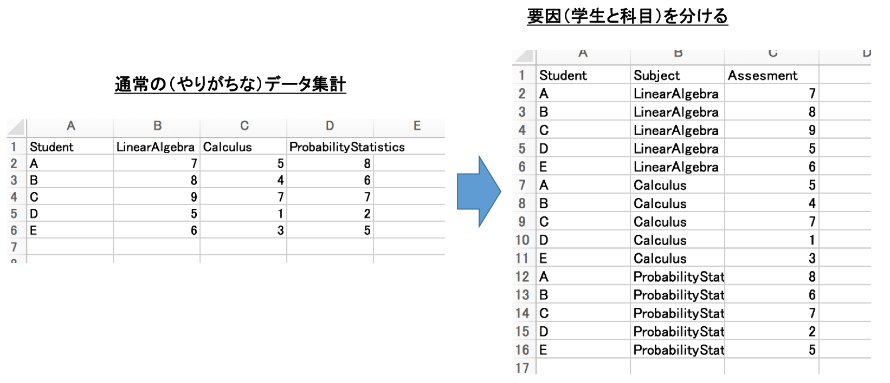

# 演習

1. 看護の教育方法として、講義型（L）、実習型（E）の２つの形態による理解度の違いを調べた。
それぞれの授業に参加した学生７名（A$\sim$G)をランダムに抽出し、最終テストの得点で比較することにした。

(1) これは対応ありですか？対応なしですか？(どちらを選んでも理由が間違いでなければ正答)

(2) それぞれの母集団が正規性を満たして<u>いる</u>として、LとEに差があるかを評価しなさい。

(3) それぞれの母集団が正規性を満たして<u>いない</u>として、LとEに差があるかを評価しなさい。

| Student | A | B | C | D | E | F | G |
| --- | --- | --- | --- | --- | --- | --- | --- |
| L | 51 | 66 | 70 | 75 | 73 | 62 | 55 |
| E | 55 | 37 | 47 | 60 | 62 | 53 | 50 |

# 復習

被験者全員に同じ薬を使って投薬前後での白血球の量を調べた。なお母集団のデータは正規分布に<u>従っていない</u>ものとする。投薬前後の白血球の量に違いがあるかどうかを調べるには、どのような検定が必要でしょう？

＿＿＿＿

第１群は地域A、第２群は地域Bに住む患者群として、それぞれの血圧を調べた。それぞれの群の母集団は正規分布に従うとする。地域によって血圧が異なるかどうかを調べるには、どのような検定が必要でしょうか？

＿＿＿＿

ここまでは、２群比較のための検定を行ってきました。ですが、上の１つ目の例で言えば、投薬前、投薬直後、投薬後１時間、、、（２つ目の例でも、例えば地域C, D, $\cdots$）のように3群以上の標本の比較を行いたい場合があります。3群以上の比較を行いたいときに使う統計的方法として、<u>**分散分析（Analysis of variance: ANOVA）**</u>と呼ばれるものがあります。

分散分析において有意差が出た（=どれか2群の間に差が出たということ）場合、次にどの群に差が出たのかを調べたいと思うのが常です。群間の比較を調べるには<u>**多重比較法**</u>を使います（なお、分散分析と絡めずに最初から多重比較法だけで行うほうが良いと主張する研究者も多くいますが、この演習では両方を学んでおきたいと思います）。

分散分析や多重検定を手計算で行うのは大変です。しかし、コンピュータでは<u>**たった一行で**</u>それを計算してくれるコマンドが存在します。簡単です！一方、コンピュータで計算する際に大事なことは、<u>**読み込むデータの書き方**</u>になります。この演習では、<u>**データの書き方（エクセルの作り方）**</u>を学ぶことが実用上一番の目的となります。

# 一元配置分散分析（対応なし）

StatisticsTest.csvというデータを用意しています。まずはどういう構造になっているかエクセルで開いて確認しておきましょう
(A$\sim$Dはある勉強方法を示しており、数字はそのような勉強方法によるテストの結果（点数）を示しているとします）。
確認したら、StatisticsTest.csvをRで読み込んでください。

```r
> data <- read.csv("StatisticsTest.csv")
> data
```

dataに格納されたら、<u>aov関数を使って分散分析</u>を行います。$p$値はいくらでしょう？

```r
> summary(aov(data$Statistics ~ data$Instruction))
```

帰無仮説H$_0$: ４群の母平均は等しい。

対立仮説H$_1$: ４群の母平均は等しくない。

有意水準: 5%

$p$値が＿＿＿＿であるので、統計検定量は有意水準＿＿＿＿であり、
帰無仮説は＿＿＿＿

ここでわかったことは、４群の組み合わせのうち、少なくとも１つの組み合わせで差がありそうだということだけで、どの組み合わせに差があるのかまでは教えてくれていません。そのため、次に多重比較を行う流れになります。ここではTukeyの方法という多重比較法を用いてみます。

```r
> TukeyHSD(aov(data$Statistics ~ data$Instruction))
```

有意水準を5%とした場合、有意差が生じたのはどの組み合わせでしょうか？

＿＿＿＿

# 一元配置分散分析（対応あり）

SubjectAssesment.csvというデータを用意しています。同じくどういう構造になっているかエクセルで開いて確認しておきましょう
（A$\sim$Eの学生の代数（Linear Algebra）、微積（Calculus）、確率統計（Probability and Statistics）の好感度と考えることにします）。
今度もaov関数を使って解析します。ただし、前回と違ってデータをそのまま使って解析することはできません。
<u>**aov関数を使う場合、データ構造を図1に示すような形式にしないといけないのです**</u>。

データ形式の修正は、勿論、エクセル上で行ってもよいしR上で行ってもよいです（データ数が少ない場合、エクセルでも十分ですが、膨大なデータを扱う場合にはRや他のプログラム言語を使用しないとできない場合もあります）。今回は、エクセル上で編集してみてください。図1右のように修正したら、作業ディレクトリにcsv形式で保存して次を実行してください（ここではSubjectAssesment2.csvという名前で保存したことにします）。

```r
> data <- read.csv("SubjectAssesment2.csv")
> summary(aov(data$Assesment ~ data$Student + data$Subject))
```

帰無仮説H$_0$: ３科目の学生評価は等しい。

対立仮説H$_1$: ３科目の学生評価は等しくない。

有意水準: 5%

$p$値が＿＿＿＿であるので、統計検定量は有意水準＿＿＿＿であり、
帰無仮説は＿＿＿＿

多重比較も行ってみましょう。

```r
> TukeyHSD(aov(data$Assesment ~ data$Student + data$Subject))
```

このまま実行すると、ブロック因子であるStudentについての比較も表示されます。比較したい対象だけを表示したい場合には、次のように項目名を指定することもできます。

```r
> fit <- aov(Assesment ~ Student + Subject, data=data)
> TukeyHSD(fit, "Subject")
```



ところで、今のデータでは、一人の学生が３つの科目を評価しました。
これがもし学生が全てばらばらの15人で評価したデータであった場合にはどうすれば良いでしょうか？
その場合は、<u>対応なしの分散分析</u>を行います。
そう思って分析してみましょう。

```r
> data <- read.csv("SubjectAssesment2.csv")
> summary(aov(data$Assesment ~ data$Subject))
> TukeyHSD(aov(data$Assesment ~ data$Subject))
```

対応ありの分散分析と何が違うかわかりますか？
そう、対応ありの場合、

<u>**一人の学生が３つの科目を評価することによって、個人差を評価できる**</u>

ようになり、個人のばらつきを考慮して科目をより正しく評価できるようになります。

# 二元配置分散分析（対応なし）

今度は評価の要因が２つある場合を考えます。
TasteAssesment.csvを用意しています。
どういう構造になっているかエクセルで開いて確認してください
（これは一列目：保存状態A, Bに対し、二列目：水メーカー各社の水（I, V, B）の三列目：美味しさを点数付けしたデータです。
美味しさの要因は、保存状態とメーカーの種類の２つが考えられますね。
なお、修正が必要ないように形式を整えています）。
やることは同じですが、要因が複数ある場合には交互作用を加えて評価します。
交互作用とは複数の要因が合わさることで生じる効果のことで、
解析では（因子）:（因子）という形式で書きます。
交互作用を含めて分析する場合には、*を使うこともできます。
以下を実行しましょう。

```r
> data <- read.csv("TasteAssesment.csv")
> summary(aov(data$Assesment ~ data$Temp + data$Maker + data$Temp : data$Maker))
```

もしくは、

```r
> summary(aov(data$Assesment ~ data$Temp * data$Maker))
```

帰無仮説H$_0$: 保存方法（Temp）によって評価は変化しない。

対立仮説H$_1$: 保存方法（Temp）によって評価は変化する。

有意水準: 5%

$p$値が＿＿＿＿であるので、統計検定量は有意水準＿＿＿＿であり、
帰無仮説は＿＿＿＿

帰無仮説H$_0$: 銘柄（Maker）によって評価は変化しない。

対立仮説H$_1$: 銘柄（Maker）によって評価は変化する。

有意水準: 5%

$p$値が＿＿＿＿であるので、統計検定量は有意水準＿＿＿＿であり、
帰無仮説は＿＿＿＿

帰無仮説H$_0$: 保存方法と銘柄の組み合わせによって評価は変化しない。

対立仮説H$_1$: 保存方法と銘柄の組み合わせによって評価は変化する。

有意水準: 5%

$p$値が＿＿＿＿であるので、統計検定量は有意水準＿＿＿＿であり、
帰無仮説は＿＿＿＿

保存状態（Temp）に対して味の評価（Assesment）を平均してみます。グラフにすると分かり易いので、次のような関数でプロットしてみましょう。

```r
> interaction.plot(data$Maker,data$Temp,data$Assesment)
```

次に銘柄（Maker）に対して味の評価（Assesment）を平均してみます。

```r
> interaction.plot(data$Temp,data$Maker,data$Assesment)
```

これらの図を他の人に説明してみてください。横軸と縦軸は何でしょうか？これらの図から何がわかりますか？

＿＿＿＿

# 二元配置分散分析（２要因とも対応あり）

上と同じデータを使い、"２要因とも対応あり"の場合に拡張してみたいと思います。
"２要因とも対応あり"とは、同じ人が保存方法や銘柄の違いをそれぞれ評価した、ということです（裏を返せば、前節の結果は、全て異なる人で保存方法や銘柄による味のデータを集めていたということです）。
TasteAssesment.csvに評価者（Studentという項目で、各Temp $\times$ Makerの組み合わせごとにA$\sim$Eが1回ずつ現れるようにしてください）を加えてTasteAssesment2.csvという名前で保存してください。わからない、もしくはヒントが欲しい人はTasteAssesment2hint.csvをダウンロードしてください。
分析は次のように行います。

```r
> data <- read.csv("TasteAssesment2.csv")
> summary(aov(data$Assesment ~ data$Temp * data$Maker + Error(data$Student
+ data$Student:data$Temp + data$Student:data$Maker
+ data$Student:data$Temp:data$Maker)))
```

対応なしとの違いは、後半の

Error(data$Student
+ data$Student:data$Temp + data$Student:data$Maker

+ data$Student:data$Temp : data$Maker))

の部分です。それでは以下を埋めましょう。

帰無仮説H$_0$: 保存方法（Temp）によって評価は変化しない。

対立仮説H$_1$: 保存方法（Temp）によって評価は変化する。

有意水準: 5%

$p$値が＿＿＿＿であるので、統計検定量は有意水準＿＿＿＿であり、
帰無仮説は＿＿＿＿

帰無仮説H$_0$: 銘柄（Maker）によって評価は変化しない。

対立仮説H$_1$: 銘柄（Maker）によって評価は変化する。

有意水準: 5%

$p$値が＿＿＿＿であるので、統計検定量は有意水準＿＿＿＿であり、
帰無仮説は＿＿＿＿

帰無仮説H$_0$: 保存方法と銘柄の組み合わせによって評価は変化しない。

対立仮説H$_1$: 保存方法と銘柄の組み合わせによって評価は変化する。

有意水準: 5%

$p$値が＿＿＿＿であるので、統計検定量は有意水準＿＿＿＿であり、
帰無仮説は＿＿＿＿

前節では、交互効果がみられませんでした。
しかし今回、同じデータを使ったのですが、個人差を排除した評価になっているために有意差が出やすくなります。
結果はどうだったでしょうか？

# 二元配置分散分析（１要因のみ対応あり）

続いて、"１要因のみ対応あり"という状況を考えてみます。
上と同じデータを使いますが、保存方法（Temp）がBのときの評価者（Student）をF$\sim$Jに変更し、
TasteAssesment3.csvという名前で保存してください（もうヒントは要らないですね？）。
次を実行します。

```r
> data <- read.csv("TasteAssesment3.csv")
> summary(aov(data$Assesment ~ data$Temp * data$Maker + Error(data$Student/data$Maker)))
```

Error()には、被験者差と、同じ被験者が繰り返し評価した要因に対応する誤差項を指定します。

# 演習1

1. ある大学の法学部（Law）、文学部（Literature）、理学部（Science）、工学部（Technology）の４学部から８名ずつの学生を無作為抽出してそれぞれテストを行った結果が以下で示されている。

(1) これは対応ありですか？対応なしですか？

(2) 学部間でテストの母平均に差があるかどうかを有意水準5%で分散分析で評価しなさい。

(3) 同じくTukeyの多重比較を実行し、どこに差があるかを評価しなさい。

| Department | A | B | C | D | E | F | G | H |
| --- | --- | --- | --- | --- | --- | --- | --- | --- |
| % | A | B | C | D | E | F | G | H |
| Law | 75 | 61 | 68 | 58 | 66 | 55 | 65 | 63 |
| Literature | 62 | 60 | 66 | 63 | 55 | 53 | 59 | 63 |
| Science | 65 | 60 | 78 | 52 | 59 | 66 | 73 | 64 |
| Technology | 52 | 59 | 44 | 67 | 47 | 53 | 58 | 49 |

1. 看護の教育方法として、講義型（L）、問題型（P）、実習型（E）の３つの形態による理解度の違いを調べた。
学生７名（A$\sim$G)を抽出し、全員がその３種類の教育を受けてテストの得点で比較することにした。

(1) これは対応ありですか？対応なしですか？

(2) テストに差があるかどうかを有意水準5%で分散分析で評価しなさい。

(3) 同じくTukeyの多重比較を実行し、どこに差があるかを評価しなさい。

| Student | A | B | C | D | E | F | G |
| --- | --- | --- | --- | --- | --- | --- | --- |
| L | 51 | 66 | 70 | 75 | 73 | 62 | 55 |
| P | 47 | 54 | 55 | 39 | 60 | 62 | 56 |
| E | 55 | 37 | 47 | 60 | 62 | 53 | 50 |
