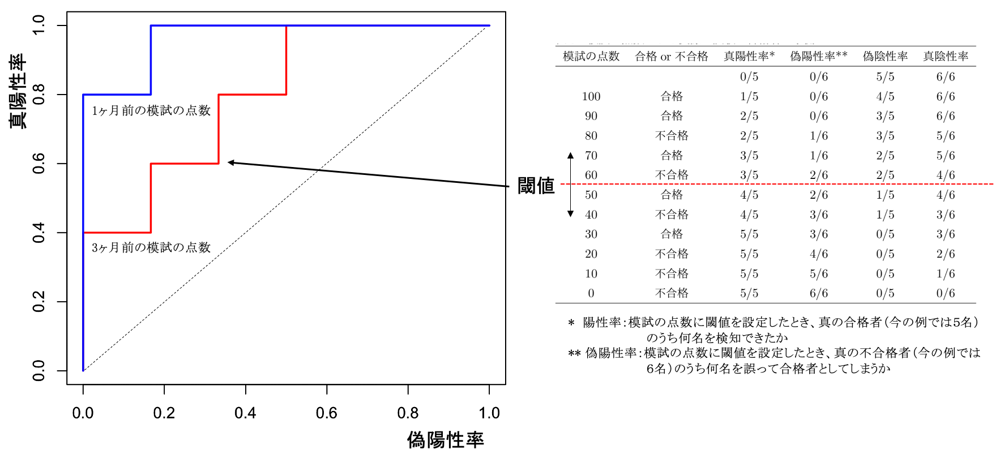

# ROC解析と推論の評価

「健康・病気」などのような２つの値（二値）をとる事象を考えます。
そしてこれを検診の「白血球数」から予測することを考えてください。
白血球数がある基準範囲内であれば健康、外れるようであれば病気と予測するとしましょう。
検査結果で病気が疑われるケースを**陽性**、疑われないケースを**陰性**と言います。
この陽性と陰性を分ける点（今の例では白血球の数）
を**カットオフ値**（**閾値**）と呼びます。
この値を極端にとれば、被検者の多くを陽性とすることもできますし、逆にその多くを陰性とすることもできます。
被検者の多くを陽性とするようなカットオフ値では、
実際に病気でない人を病気と判定することで（これを**偽陽性**という）
さらなる検査を要請することになり資源の無駄や被検者の負担を増やしてしまいます。
逆に陰性に偏るようなカットオフ値では、偽陽性は少なくなりますが、
本当は病気なのに誤って健康と判定する（これを**偽陰性**という）
ことを避けることができなくなります。
適切なカットオフ値を決めることは重要であることがわかります。
また、「白血球数」に加えて「血小板数」も病気の予測に用いた場合、予測の精度は増すでしょうか？
このように二値推論の複数のモデルを比較することでより良い予測モデルを定量的に評価したいことがあります。
カットオフ値による予測性能の変化の振る舞いや推論モデルの比較に使われるのが
Receiver Operating Characteristic (ROC) curve（ROC曲線）です。
実際起こった現象と予測の結果を比較する場合、表2の$2\times2$分割表（**混同行列**）を使うとわかりやすくなります。
ROC曲線は、閾値を変えながら混同行列を作成し、偽陽性率を横軸に真陽性率（感度）をプロットすると描くことができます。
まずは表2に示されている混同行列の形と指標の定義を頭に入れましょう
。

|  | A | B | C |
| --- | --- | --- | --- |
|  |  | 真 | 偽 |
| 予測 | 真 | 真陽性 | 偽陽性 |
|  | 偽 | 偽陰性 | 真陰性 |

## ROC曲線の描画

<u>横軸を偽陽性率、縦軸を真陽性率（感度）として閾値を変えてプロットしたものがROC曲線です</u>。
それでは今回も例題を通してROC曲線の描画にチャレンジしてみましょう。

表3の「模試（入試3ヶ月前）の点数 vs. 入試結果」 と
「模試（入試1ヶ月前）の点数 vs. 入試結果」 を使って２つのROC曲線を描いてください。

解答を見ておきましょう。図の赤線が入試3ヶ月前、青線が入試1ヶ月前の点数に基づいたROC曲線です。
これを描くために、この図の右側に示してある表のように、模試の点数に閾値を設定し、
その閾値によって真の合格者のうち何名を検知できたか（真陽性率=感度）と
真の不合格者のうち何名を誤って合格者としてしまうか（偽陽性率=1-特異度）を算出します。
あとは縦軸の真陽性率を横軸の偽陽性率に対してプロットすることでここで示されたROC曲線を得ることができます。

| 模試（入試3ヶ月前）の点数 | 入試結果 | 模試（入試1ヶ月前）の点数 | 入試結果 |
| --- | --- | --- | --- |
| 100 | 合格 | 100 | 合格 |
| 90 | 合格 | 90 | 合格 |
| 80 | 不合格 | 80 | 合格 |
| 70 | 合格 | 70 | 合格 |
| 60 | 不合格 | 60 | 不合格 |
| 50 | 合格 | 50 | 合格 |
| 40 | 不合格 | 40 | 不合格 |
| 30 | 合格 | 30 | 不合格 |
| 20 | 不合格 | 20 | 不合格 |
| 10 | 不合格 | 10 | 不合格 |
| 0 | 不合格 | 0 | 不合格 |



模試の点数によって実際の試験の合格者はどのくらい正確に予測できたのか、ということをこのROC曲線から評価してみましょう。
まず、閾値を幾つに設定すると合格・不合格をよりよく予測できるでしょうか？
これに対しては、Balanced Error Rate (BER)という指標が時々使われます。予測の誤りは偽陽性率と偽陰性率の２通りがありますが、
BERはその平均（（偽陽性率+偽陰性率）/2）で与えられます。これは**誤分類率**を意味しており、BERを最小にする閾値が間違いの少ない閾値であるという考え方に則っています。

ROC曲線を積分したもの（曲線の下の領域の面積）を**Area Under the Curve (AUC)**といい、モデルの予測性能を定量的に評価するときに便利です。
今の例では、模試（入試3ヶ月前）の点数と模試（入試1ヶ月前）の点数が予測モデルであり、AUCは
それぞれ0.8と0.966$\cdots$です。AUCは最大が1であり、1に近いほど予測性能が良いと言えることになります。
今回の例では、模試（入試1ヶ月前）の点数で入試の合否を予測するモデルの方が優れていると言えます。

最後にpROCもしくはROCRというライブラリを使ったRによるROC解析の例を示しておきます。

## pROCによるROC解析

pROCライブラリのインストールは

```r
> install.packages("pROC")
```

とします（既にインストールされているようであれば行う必要はありません）。
pROCを使うには次のライブラリ関数でpROCライブラリを読み込みます。

```r
> library(pROC)
```

このlibrary(pROC)はROC解析をする時に毎回宣言しなければならないことに注意しておいてください。
それでは、
Pointに模試（入試3ヶ月前）の点数を、
Classに合否（合格を1, 不合格を0）

を登録し、
pROCライブラリのroc関数を使って
ROC曲線を書かせてみましょう。

```r
> Point = c(0,10,20,30,40,50,60,70,80,90,100)
> Class = c(0,0,0,1,0,1,0,1,0,1,1)
> ROC1 = roc(Class, predictor=Point, levels=c(0,1), direction="<")
> plot(ROC1,col="Red", legacy.axes=TRUE)
```

図の赤線を書かせることができたと思います。
4行目でROC解析を実施しています。levels=c(0,1)は0を陰性、1を陽性として扱うという指定です。direction="$<$"は、予測に使う値（ここでは模試の点数）が大きいほど陽性（合格）らしい、という向きを指定しています。
5行目ではlegacy.axes=TRUEを指定し、横軸を1-Specificity（偽陽性率）、縦軸をSensitivity（真陽性率）としてプロットしています。
AUCは以下で確認できます。

```r
> ROC1
```

なお、２つのROC曲線に差があるかどうかを検定する方法としてdelong検定というものがあり、
pROCでは関数が用意されている。
模試（入試1ヶ月前）の点数についてのROC解析を実施し、それをROC2として保存しているとしよう。
ROC1とROC2の両者に差があるかどうかを検定するには、

```r
> roc.test(ROC1, ROC2, method="delong", alternative="two.sided")
```

とすればよい。

## ROCRによるROC解析

ROCRライブラリのインストールは

```r
> install.packages("ROCR")
```

とします。インストールしたら、次のライブラリ関数でROCRライブラリを読み込みます。

```r
> library(ROCR)
```

このlibrary(ROCR)はROC解析をする時に初めに宣言しなければならないことに注意しておいてください。
それでは、
Pointに模試（入試3ヶ月前）の点数を、
Classに合否（合格を1, 不合格を0）

を登録し、
ROCRライブラリの関数predictionやperformanceを使って
ROC曲線を書かせてみましょう。

```r
> Point = c(0,10,20,30,40,50,60,70,80,90,100)
> Class = c(0,0,0,1,0,1,0,1,0,1,1)
> pred = prediction(Point,Class)
> perf = performance(pred,"tpr","fpr")
> plot(perf,col="Red",lwd = 2)
```

同じく図の赤線を書かせることができたと思います。4行目の"tpr"と"fpr"
は真陽性率（true positive rate)と偽陽性率（false positive rate)のことです。
5行目で縦軸をtpr、横軸をfprとしてプロットしています。
AUCは次のようにして計算することができます。

```r
> auc.tmp = performance(pred,"auc")
> as.numeric(auc.tmp@y.values)
```

ここでは模試の点数による合否の予測という例でROC曲線とその解析について説明しました。
模試の点数をもっと複雑なモデルにすることで人工知能っぽくすることができます。
例えば、模試の点数も１つの模試だけではなく過去に受けた模試の点数の時系列データや
性別・年齢・居住地域・親の年収・学生時代の部活動等々を入力にして合格確率を出力するモデルを作ったとします。
このモデルの性能は、モデルの合格確率と実際の合否でROC曲線を描かせることで
模試の点数単独のモデルと同じように評価・比較することができます。

# 演習

1. E_11_ROC.csvをダウンロードし、Histologyに対する項目EnergyのROC解析を実施し、そのAUCを求めよ。

1. 上記の解析において、Cutoff=0.5及びBERを最小とした時の感度と特異度を求めよ。

1. 最もAUCの値が大きくなる項目を探索せよ（Rスクリプトでfor文を使って一気に計算するスクリプトを作成し、manabaに貼り付けること）。
